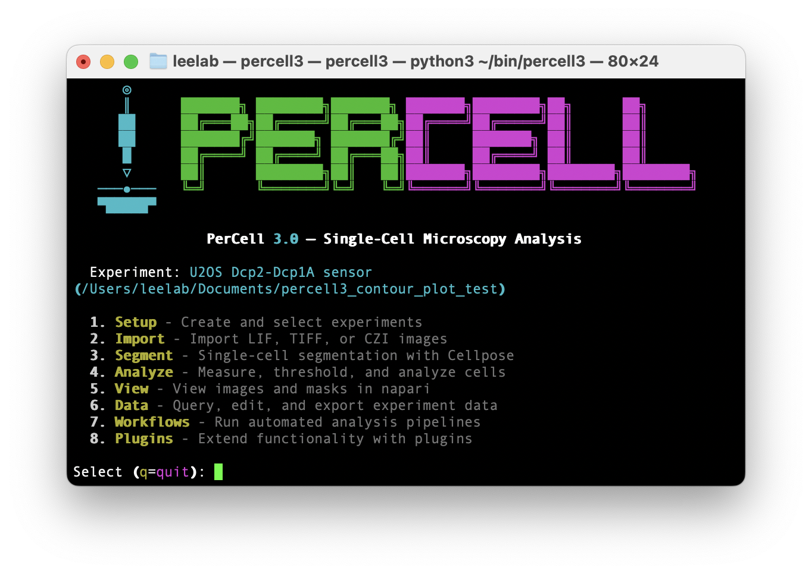

# PerCell 3

[](https://www.python.org/downloads/)
[](https://github.com/marcusjoshm/percell3/)
[](https://github.com/marcusjoshm/percell3/blob/main/LICENSE)



Single-cell microscopy analysis platform built on OME-Zarr and SQLite.

PerCell 3 replaces PerCell 2's filesystem-based data model with a proper experiment database. It provides a complete pipeline from image import through segmentation, measurement, thresholding, particle analysis, and data export.

## Architecture

- **ExperimentStore** — Central hub. OME-Zarr for pixel data, SQLite for metadata and measurements.
- **Hexagonal design** — Domain logic has no framework dependencies. External tools (Cellpose, napari) accessed through adapter interfaces.
- **Channels are first-class** — Segment on DAPI, measure on GFP/RFP. Any operation can target any channel.
- **Plugin system** — Analysis plugins read from ExperimentStore and write results back. Visualization plugins launch interactive viewers.

## Modules

| Module | Description |
|--------|-------------|
| `core` | ExperimentStore, schema, Zarr I/O |
| `io` | Format readers (TIFF, LIF, CZI) with auto-grouping scanner |
| `segment` | Cellpose segmentation engine + napari viewer |
| `measure` | Per-cell metrics, cell grouping (GMM), thresholding, particle analysis |
| `plugins` | Plugin system (AnalysisPlugin + VisualizationPlugin ABCs), local BG subtraction, 3D surface plot |
| `workflow` | DAG-based workflow engine with preset pipelines |
| `cli` | Click CLI with interactive menu |

## Installation

```bash
pip install -e ".[dev]"
```

Optional extras:

```bash
pip install -e ".[lif]"       # Leica LIF support (readlif, GPL)
pip install -e ".[czi]"       # Zeiss CZI support (aicspylibczi)
pip install -e ".[workflow]"  # YAML workflow engine (pyyaml)
pip install -e ".[napari]"    # Napari viewer (napari + PyQt5)
pip install -e ".[all]"       # Everything
```

## Quick Start

```bash
# Launch the interactive menu (recommended)
percell3

# Or use CLI commands directly:
percell3 create ./my_experiment.percell -n "My Experiment"
percell3 import /path/to/tiffs -e ./my_experiment.percell -c control --auto
percell3 segment -e ./my_experiment.percell -c DAPI
percell3 export results.csv -e ./my_experiment.percell
```

## Interactive Menu

Running `percell3` without arguments launches the interactive menu with an ASCII art banner. The menu auto-loads your most recent experiment on startup.

| Key | Menu | Sub-items |
|-----|------|-----------|
| `1` | Setup | Create experiment, Select experiment |
| `2` | Import | Import LIF, TIFF, or CZI images |
| `3` | Segment | Cellpose segmentation with model/diameter selection |
| `4` | Analyze | Measure channels, Apply threshold + particle analysis |
| `5` | View | View images and masks in napari |
| `6` | Data | Query experiment, Edit experiment, Export to CSV |
| `7` | Workflows | Run automated analysis pipelines |
| `8` | Plugins | Local BG subtraction, 3D Surface Plot |
| `?` | Help | Show CLI command reference |
| `q` | Quit | Exit the menu |

**Navigation keys** (available in every prompt):

- `h` — return to the home menu from anywhere
- `b` — go back one level (within a sub-menu, returns to sub-menu; at the sub-menu selector, returns home)

Sub-menus (Edit, Query, Measure, Workflow) loop after completing an action so you can perform multiple operations without re-navigating.

### Import Workflow (Import > Import images)

1. Select source: type a path, browse for folder, or browse for files (tkinter)
2. Scanner groups TIFF files by FOV token, showing a file group table
3. Choose **Auto-import** (each FOV token becomes a condition) or **Manual configuration** (batch-select groups, assign condition + bio rep per batch, auto-number FOVs)
4. Channel mapping with case-insensitive auto-match to existing channels
5. Z-projection selection: `mip` (max intensity), `sum`, `mean`, `keep`
6. Confirmation with assignment summary table

### Segmentation Workflow (Segment > Segment cells)

1. Select channel to segment
2. Select Cellpose model — available models: `cpsam`, `cyto`, `cyto2`, `cyto2_cp3`, `cyto3`, `nuclei`, `bact_fluor_cp3`, `bact_phase_cp3`, `deepbacs_cp3`, `livecell`, `livecell_cp3`, `plant_cp3`, `tissuenet`, `tissuenet_cp3`, `yeast_BF_cp3`, `yeast_PhC_cp3`
3. Cell diameter in pixels (blank = auto-detect)
4. FOV status table shows existing segmentation state; select FOVs
5. Re-segmentation warning for FOVs with existing cells
6. After segmentation completes, **auto-measures all channels** on the segmented FOVs

### Measurement Modes (Analyze > Measure channels)

- **Whole cell** — all selected channels, all metrics, standard per-cell measurement
- **Inside threshold mask** — pixels where cell mask AND threshold mask are both true
- **Outside threshold mask** — pixels where cell mask is true but threshold mask is false
- **Both inside + outside** — runs both scopes

### Threshold + Particle Analysis (Analyze > Apply threshold)

1. Select grouping channel and metric (mean/median/integrated intensity, area)
2. Select threshold channel
3. Select FOVs
4. Per-FOV: GMM-based cell grouping (BIC model selection), then per-group napari threshold QC with live Otsu preview, accept/skip/skip-remaining
5. Particle analysis on accepted groups: connected component analysis with morphometrics

### Export Options (Data > Export)

- Export type: cell measurements only, particle data only, or both
- Channel filter (multi-select)
- Metric filter (multi-select)
- Scope filter: all scopes, whole cell only, inside mask only, outside mask only
- Particle metric filter: area, perimeter, circularity, intensity metrics
- When exporting both, creates `output.csv` + `output_particles.csv`
- **Threshold pair filter** — optional post-export step that drops rows where a selected channel's `area_mask_inside` is zero, then keeps only cell_ids with exactly 2 remaining rows (one per threshold). Useful for paired P-body + dilute phase analyses.

### Workflows (Menu 7)

**Particle Analysis** — Segment → measure → threshold → export pipeline.

**Decapping Sensor** — 11-step pipeline for decapping sensor phospho-mutant analysis:

1. Grouped thresholding on original FOVs (P-body detection)
2. Split-halo condensate analysis → keep dilute phase
3. Auto-assign segmentation to dilute FOVs
4. Grouped thresholding on dilute FOVs
5. Split-halo again → keep 2nd dilute phase
6. Auto-assign segmentation to 2nd dilute FOVs
7. Grouped thresholding on 2nd dilute FOVs (dilute phase detection)
8. Threshold background subtraction (dilute FOVs as histogram, originals as apply)
9. Auto-assign segmentation to BG-subtracted FOVs
10. Assign P-body + DP thresholds to BG-subtracted FOVs with auto-measurement
11. Export filtered CSV — drops rows with zero `area_mask_inside` for the BG subtraction channel, then keeps only cells with exactly 2 threshold rows (1 P-body + 1 DP)

All parameters (channels, prefixes, sigma, particle size, etc.) are collected upfront before the pipeline runs.

### Plugins (Menu 8)

Plugins are auto-discovered from `percell3.plugins.builtin`. Two plugin types:

**Analysis Plugins** (`AnalysisPlugin`) — read data, write measurements back:

- **Local BG Subtraction** — Per-particle local background estimation using Gaussian peak detection on a dilated ring. Exports per-particle CSV files split by condition.

**Visualization Plugins** (`VisualizationPlugin`) — read data, launch interactive viewers:

- **3D Surface Plot** — Renders a microscopy image as a 3D heightmap in napari. Select a height channel (Z-axis elevation) and a color channel (colormap overlay). Draw an ROI rectangle, then generate an interactive 3D surface with colormap, Z-scale, and smoothing controls. Includes screenshot export.

## CLI Commands

### `percell3 create`

```
percell3 create PATH [-n NAME] [-d DESCRIPTION]
```

| Option | Description |
|--------|-------------|
| `PATH` | Path for the new `.percell` directory |
| `-n`, `--name` | Experiment name |
| `-d`, `--description` | Experiment description |

### `percell3 import`

```
percell3 import SOURCE -e EXPERIMENT [-c CONDITION] [-b BIO_REP]
         [--channel-map TOKEN:NAME ...] [--z-projection mip|sum|mean|keep]
         [--files FILE ...] [--yes] [--auto]
```

| Option | Default | Description |
|--------|---------|-------------|
| `SOURCE` | — | Path to TIFF directory |
| `-e`, `--experiment` | — | Path to `.percell` experiment |
| `-c`, `--condition` | `default` | Condition name |
| `-b`, `--bio-rep` | `N1` | Biological replicate name |
| `--channel-map` | — | Channel mapping (e.g. `00:DAPI`), repeatable |
| `--z-projection` | `mip` | Z-stack projection method |
| `--files` | — | Specific TIFF files to import, repeatable |
| `--yes`, `-y` | — | Skip confirmation prompt |
| `--auto` | — | Auto-import: each FOV token becomes a condition |

### `percell3 segment`

```
percell3 segment -e EXPERIMENT -c CHANNEL [--model MODEL]
         [--diameter FLOAT] [--fovs FOV1,FOV2] [--condition COND] [-b BIO_REP]
```

| Option | Default | Description |
|--------|---------|-------------|
| `-e`, `--experiment` | — | Path to `.percell` experiment |
| `-c`, `--channel` | — | Channel name to segment |
| `--model` | `cpsam` | Cellpose model name |
| `--diameter` | auto-detect | Cell diameter in pixels |
| `--fovs` | all | Comma-separated FOV names |
| `--condition` | all | Filter FOVs by condition |
| `-b`, `--bio-rep` | all | Filter FOVs by biological replicate |

### `percell3 view`

```
percell3 view -e EXPERIMENT -f FOV [--channels CH1,CH2]
```

| Option | Default | Description |
|--------|---------|-------------|
| `-e`, `--experiment` | — | Path to `.percell` experiment |
| `-f`, `--fov` | — | FOV display name to view |
| `--channels` | all | Comma-separated channel names to load |

Opens napari with channel images, segmentation labels, and threshold masks. Label edits are saved back on close.

### `percell3 query`

```
percell3 query -e EXPERIMENT SUBCOMMAND [--format table|csv|json]
```

| Subcommand | Description |
|------------|-------------|
| `channels` | List channels (name, role, color) |
| `fovs` | List FOVs (name, condition, bio_rep, size, pixel_size) with `--condition` and `--bio-rep` filters |
| `conditions` | List all conditions |
| `bio-reps` | List all biological replicates |
| `summary` | Per-FOV summary (cells, model, measured channels, masked channels, particles) |
| `add-bio-rep NAME` | Add a biological replicate |

### `percell3 export`

```
percell3 export OUTPUT -e EXPERIMENT [--overwrite]
         [--channels CH1,CH2] [--metrics M1,M2] [--include-particles]
```

| Option | Default | Description |
|--------|---------|-------------|
| `OUTPUT` | — | Output CSV file path |
| `-e`, `--experiment` | — | Path to `.percell` experiment |
| `--overwrite` | — | Overwrite if file exists |
| `--channels` | all | Comma-separated channel filter |
| `--metrics` | all | Comma-separated metric filter |
| `--include-particles` | — | Also export particle data to `<name>_particles.csv` |

### `percell3 workflow`

```
percell3 workflow list [--steps] [--format table|csv|json]
percell3 workflow run NAME -e EXPERIMENT [--force]
```

Lists or runs preset workflows (`complete`, `measure_only`).

## Napari Viewer

The napari viewer (`percell3 view` or View > View in napari) opens FOVs with:

- **Channel image layers** with automatic colormap assignment (blue for DAPI, green for GFP, red for RFP)
- **Segmentation labels** (opacity 0.5, change detection on close for save-back)
- **Threshold mask layers** (magenta, additive blending, hidden by default)

### Dock Widgets

**Cellpose Widget** — Run segmentation directly from napari:
- Model selection (including custom model file paths)
- Primary + optional nucleus channel
- Diameter, cell probability threshold (-8.0 to 8.0), flow threshold (0.0 to 3.0)
- GPU auto-detection (CUDA and MPS)
- Background execution with auto-measure on completion

**Edit Labels Widget** — Manual label editing:
- **Delete Cell**: click on a cell label to select, then delete
- **Draw Cell (Polygon)**: click vertices to draw a polygon, confirm to rasterize as a new label

**Threshold QC Viewer** (launched from Analyze > Apply threshold):
- Live threshold preview with Otsu auto-compute
- ROI rectangle drawing to restrict threshold region
- Accept / Skip / Skip Remaining buttons per cell group
- Real-time positive pixel count and fraction display

**3D Surface Plot Widget** (launched from Plugins > surface_plot_3d):
- Height channel + color channel dropdowns
- Colormap selector (viridis, plasma, magma, inferno, turbo, hot, gray)
- Z-scale slider (1–200) for height exaggeration
- Smoothing sigma slider (0.0–10.0) for Gaussian blur on height data
- Generate Surface button with interactive ROI rectangle selection
- Save Screenshot button (exports to `{experiment}/exports/`)
- **3D navigation:** left-click drag = rotate, Shift + left-click drag = pan, scroll = zoom

## Measurement Metrics

7 built-in per-cell metrics, all computed with bounding-box optimization:

| Metric | Description |
|--------|-------------|
| `mean_intensity` | Average pixel intensity within cell mask |
| `max_intensity` | Maximum pixel intensity |
| `min_intensity` | Minimum pixel intensity |
| `integrated_intensity` | Sum of pixel intensities |
| `std_intensity` | Standard deviation of intensity |
| `median_intensity` | Median pixel intensity |
| `area` | Cell area in pixels |

Custom metrics can be registered via `MetricRegistry.register(name, func)`.

## Particle Analysis

Per-cell particle detection from threshold masks:

- Connected component analysis with minimum area filter (default 5 px)
- Per-particle morphometrics: area, perimeter, circularity, eccentricity, solidity, axis lengths
- Per-particle intensity: mean, max, integrated
- Per-cell summary: particle count, total/mean/max area, coverage fraction, intensity aggregates

## Data Model

Each `.percell` experiment directory contains:

```
experiment.percell/
├── experiment.db      # SQLite: metadata, measurements, particles
├── images.zarr/       # OME-NGFF: raw channel images
├── labels.zarr/       # Segmentation label images
├── masks.zarr/        # Binary threshold masks
└── exports/           # CSV exports
```

**Hierarchy:** Experiment → Conditions → Biological Replicates → FOVs → Cells → Measurements/Particles

## Running Tests

```bash
pytest tests/ -v                     # Full suite
pytest tests/test_core/ -v           # Single module
pytest tests/test_cli/ -v            # CLI tests
pytest -m "not slow"                 # Skip slow tests (Cellpose model downloads)
```

## Technology Stack

- **Python 3.10+** with scientific libraries (NumPy, SciPy, pandas)
- **Image Storage**: zarr + ome-zarr (OME-NGFF 0.4), dask.array for lazy/chunked access
- **Database**: SQLite (stdlib sqlite3, WAL mode)
- **Segmentation**: Cellpose (3.x/4.x)
- **Image Processing**: scikit-image, scipy, scikit-learn (GMM cell grouping)
- **Visualization**: napari (optional) with custom dock widgets
- **CLI**: click + rich for interactive terminal menus
- **Architecture**: Hexagonal design with plugin system and dependency injection

## License

MIT
