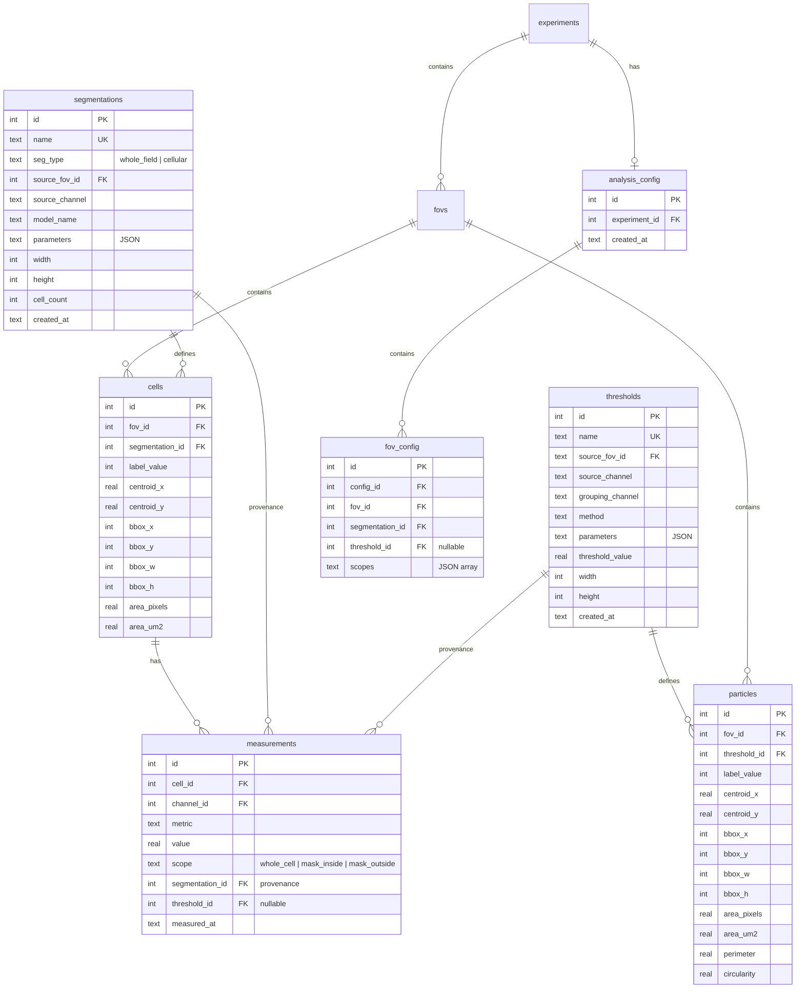

# refactor: Layer-Based Architecture Redesign

## Overview

Replace the per-FOV run-scoped architecture (Phases 1-4) with a layer-based model where segmentation and thresholding are global entities composed through a per-FOV configuration matrix. Measurement becomes fully automatic — a side effect of layer creation/modification, never a user action.

**What changes**: ~560 lines of config management code removed, `segmentation_runs` and `threshold_runs` tables restructured into global `segmentations` and `thresholds` tables, zarr paths flattened from `fov_{id}/seg_{run_id}/0` to `seg_{id}/0`, automatic measurement pipeline added, single per-experiment config with matrix view.

**What stays**: Named entities with UNIQUE constraints, scope-based measurements, cascade delete with impact preview, plugin input requirements framework.

**Fresh start only**: No migration from old schema. New architecture applies only to new experiments.

## Problem Statement

The Phase 1-4 run-scoped refactor over-engineered the measurement configuration layer:
- `measurement_configs` + `measurement_config_entries` tables add indirection users find confusing
- 7 CLI config sub-handlers (~365 lines) for a concept most users don't understand
- Measurements require explicit triggering instead of being automatic
- seg_runs are per-FOV but users want to share segmentations across FOVs

See `docs/solutions/architecture-decisions/run-scoped-architecture-refactor-learnings.md` for the full post-mortem.

## Entity Relationship Diagram



**Note on `fov_config` cardinality**: This table has zero-to-many rows per FOV, not one-row-per-FOV. An FOV with no thresholds has one row (segmentation assigned, `threshold_id` NULL). An FOV with two thresholds has two rows — one per FOV-threshold combination. Each row shares the same `segmentation_id` for that FOV. This is the "one row per FOV-threshold combo" pattern from the brainstorm.

## Technical Approach

### Architecture

The core shift: segmentation and thresholding are **independent global layers** stored once in zarr and referenced by any FOV through configuration. The configuration is a single per-experiment matrix that composes layers onto FOVs.

**Zarr layout** (flat by ID):
```
labels.zarr/
  seg_1/0          # whole_field for FOV1
  seg_2/0          # whole_field for FOV2
  seg_3/0          # cyto3_DAPI_001
  seg_4/0          # hand_drawn_DAPI_001

masks.zarr/
  thresh_1/0            # binary mask
  thresh_1/particles/0  # particle labels

images.zarr/
  fov_1/0          # (C, Y, X) channel images
  fov_2/0
```

**Auto-measurement pipeline**: Every layer operation (create, edit, delete) triggers the appropriate measurements. No separate measurement step exists.

**Config as view filter + gap filler**: The config primarily determines which measurements appear in exports. When a config change creates a new (seg, thresh) combination that hasn't been measured, the system auto-computes the missing measurements.

### Implementation Phases

#### Phase 1: Schema Foundation
- [x] Create new `segmentations` table (global, with `seg_type`, `source_fov_id`, `width`, `height`)
- [x] Create new `thresholds` table (global, with `source_fov_id`, `source_channel`, `grouping_channel`, `width`, `height`)
- [x] Create `analysis_config` table (single per experiment)
- [x] Create `fov_config` table (per-FOV layer assignments, one row per FOV-threshold combo)
- [x] Update `cells` table FK: `segmentation_id` → references `segmentations(id)`
- [x] Update `particles` table: change from `cell_id` FK to `fov_id` + `threshold_id` FKs
- [x] Update `measurements` table: add `segmentation_id` column, add `measured_at` timestamp, add `config_id` FK
- [x] Remove `measurement_configs` and `measurement_config_entries` tables
- [x] Remove `active_measurement_config_id` from `experiments` table
- [x] Update `EXPECTED_TABLES` and `EXPECTED_INDEXES` frozensets
- [x] Update partial unique indexes for new table structure
- [x] Write schema tests

**Files**: `src/percell3/core/schema.py`, `tests/test_core/test_schema.py`

**Success criteria**: `pytest tests/test_core/test_schema.py` passes. New tables created with correct constraints.

#### Phase 2: Models and Zarr Paths
- [x] Rename `SegmentationRunInfo` → `SegmentationInfo` (remove `fov_id`, add `seg_type`, `source_fov_id`, `width`, `height`)
- [x] Rename `ThresholdRunInfo` → `ThresholdInfo` (remove `fov_id`, remove `channel_id` ownership, add `source_fov_id`, `source_channel`, `grouping_channel`, `width`, `height`)
- [x] Add `AnalysisConfig` dataclass
- [x] Add `FovConfigEntry` dataclass (fov_id, segmentation_id, threshold_id, scopes)
- [x] Remove `MeasurementConfigInfo` and `MeasurementConfigEntry` dataclasses
- [x] Update `MeasurementRecord` to include `segmentation_id` and `measured_at`
- [x] Update `ParticleRecord`: change `cell_id` → `fov_id` + `threshold_id`
- [x] Update `label_group_path(segmentation_id)` → returns `f"seg_{segmentation_id}"`
- [x] Update `mask_group_path(threshold_id)` → returns `f"thresh_{threshold_id}/mask"`
- [x] Update `particle_label_group_path(threshold_id)` → returns `f"thresh_{threshold_id}/particles"`
- [x] Write model and zarr path tests

**Files**: `src/percell3/core/models.py`, `src/percell3/core/zarr_io.py`, `tests/test_core/test_zarr_io.py`

**Success criteria**: All model dataclasses correctly typed. Zarr path functions return flat paths.

#### Phase 3: Queries and ExperimentStore Core
- [x] Rewrite `insert_segmentation_run` → `insert_segmentation` (no `fov_id`, adds `seg_type`, `source_fov_id`, `width`, `height`)
- [x] Rewrite `select_segmentation_runs_for_fov` → `select_segmentations` (global list, optional dimension filter)
- [x] Rewrite `insert_threshold_run` → `insert_threshold` (no `fov_id`, no `channel_id`, adds `source_fov_id`, `source_channel`, etc.)
- [x] Rewrite `select_threshold_runs_for_fov` → `select_thresholds` (global list)
- [x] Delete all `measurement_config*` query functions (~140 lines)
- [x] Add `insert_fov_config_entry`, `select_fov_config`, `update_fov_config_entry`, `delete_fov_config_entry` queries
- [x] Update `insert_particles` to use `fov_id` + `threshold_id` instead of `cell_id`
- [x] Update `insert_measurements` to include `segmentation_id` and `measured_at`
- [x] Update FOV status cache CTE (lines 1456-1499) — remove `fov_id` joins on seg/thresh tables
- [x] Rewrite `delete_stale_particles_for_fov_channel` for new threshold model
- [x] Update `ExperimentStore.add_segmentation()` (new signature: no `fov_id`, takes `seg_type`, `source_fov_id`, `width`, `height`)
- [x] Update `ExperimentStore.add_threshold()` (new signature)
- [x] Add `ExperimentStore.get_or_create_analysis_config()` (auto-creates on first use)
- [x] Add `ExperimentStore.get_fov_config(fov_id)` → returns list of FovConfigEntry
- [x] Add `ExperimentStore.set_fov_config_entry(fov_id, segmentation_id, threshold_id, scopes)`
- [x] Add `ExperimentStore.get_config_matrix()` → returns full config as list of FovConfigEntry for all FOVs
- [x] Delete all measurement config methods (~120 lines from ExperimentStore)
- [x] Update `write_labels` and `read_labels` to use new zarr paths
- [x] Update `write_mask` and `read_mask` to use new zarr paths
- [x] Update `write_particle_labels` and `read_particle_labels` to use new zarr paths
- [x] Add dimension validation on `set_fov_config_entry` (seg dimensions must match FOV)
- [x] Write query and store tests

**Files**: `src/percell3/core/queries.py`, `src/percell3/core/experiment_store.py`, `tests/test_core/test_queries.py`, `tests/test_core/test_experiment_store.py`

**Success criteria**: All query functions work with new schema. ExperimentStore CRUD operations pass. Dimension validation rejects mismatches.

#### Phase 4: Whole-Field Segmentation + Auto-Config
- [x] Add `ExperimentStore.create_whole_field_segmentation(fov_id, width, height)` — creates `seg_type='whole_field'` segmentation with every-pixel-is-1 label array
- [x] Update `ExperimentStore.add_fov()` to auto-create whole-field segmentation on import
- [x] Update `ExperimentStore.add_fov()` to auto-create fov_config entry pointing to whole-field seg
- [x] Add auto-config update logic: when new segmentation created, update fov_config for matching-dimension FOVs to use newest seg
- [x] Add auto-config update logic: when new threshold created, add to fov_config for the source FOV
- [x] Add auto-naming: `_generate_segmentation_name(model_name, channel, existing_names)` → `{model}_{channel}_{n}`
- [x] Add auto-naming: `_generate_threshold_name(grouping_channel, threshold_channel, existing_names)` → `thresh_{grouping}_{threshold}_{n}`
- [x] Write tests for import flow: add_fov creates whole_field seg + config entry
- [x] Write tests for auto-config on seg/threshold creation

**Files**: `src/percell3/core/experiment_store.py`, `tests/test_core/test_experiment_store.py`

**Note on Phase 5 dependency**: Phase 4's auto-config logic initially only updates DB rows (fov_config entries). The auto-measurement wiring — calling `on_segmentation_created()`, `on_threshold_created()`, and `on_config_changed()` — gets added retroactively in Phase 5 once the auto-measurement pipeline exists. Phase 4 tests verify config correctness only; Phase 5 tests verify that config changes trigger measurements.

**Success criteria**: Every new FOV has a whole_field segmentation and config entry. New seg/thresh auto-update config. Auto-naming produces descriptive unique names.

#### Phase 5: Auto-Measurement Pipeline
- [x] Create `src/percell3/measure/auto_measure.py` — orchestrates automatic measurement
- [x] Implement `on_segmentation_created(store, segmentation_id, fov_ids)`:
  - Extract cells from labels for each FOV
  - Measure all channels, whole_cell scope, for each FOV
  - If thresholds exist in config, compute mask_inside/mask_outside and particle-cell assignment
  - Log measurement counts (fail loudly if 0 records)
- [x] Implement `on_threshold_created(store, threshold_id, fov_id)`:
  - Extract particles (connected components)
  - Assign particles to cells using active segmentation
  - Measure all channels for mask_inside/mask_outside scopes
  - Log measurement counts
- [x] Implement `on_labels_edited(store, segmentation_id, fov_id, old_labels, new_labels)`:
  - Detect changed cells (added, removed, modified) via `np.unique` diff
  - Delete measurements for removed/modified cells
  - Measure new/modified cells
  - **Propagate to all FOVs**: query fov_config for all FOVs referencing this `segmentation_id` and trigger measurement updates for each, not just the FOV being viewed
- [x] Implement `on_config_changed(store, fov_id, old_config, new_config)`:
  - Detect unmeasured (seg, thresh) combinations
  - Auto-compute missing measurements
  - Do NOT delete old measurements (retained for history)
- [x] **Failure contract**: Auto-measurement failures do NOT roll back the layer creation. The segmentation/threshold entity persists regardless. Log specifics on failure: which channel missing, which FOV, which scope produced 0 records. Unmeasured combinations are retried on the next gap-detection trigger (config change or next layer operation).
- [x] Update `Measurer.measure_fov()` to accept `segmentation_id` directly (not resolved from per-FOV list)
- [x] Update `Measurer.measure_fov_masked()` to accept `segmentation_id` and `threshold_id` directly
- [x] Fix Bug: `measure_fov_masked()` still uses `seg_runs[0]` (change to explicit `segmentation_id` parameter)
- [x] Fix Bug: auto-measure must check return value and log warning if 0 measurements
- [x] Write comprehensive auto-measurement tests

**Files**: `src/percell3/measure/auto_measure.py` (new), `src/percell3/measure/measurer.py`, `src/percell3/measure/particle_analyzer.py`, `tests/test_measure/test_auto_measure.py` (new)

**Success criteria**: Creating a segmentation triggers whole_cell measurements. Creating a threshold triggers particle extraction + mask measurements. Editing labels incrementally updates measurements for **all FOVs referencing that segmentation**. Config changes fill measurement gaps. Zero-measurement outcomes log warnings. Measurement failures never roll back layer creation.

#### Phase 6: CLI Configuration Manager
- [x] Remove old config management menu (~365 lines replaced with ~200 lines)
- [x] Add new `_config_management_menu()` with matrix table view using Rich
- [x] Display matrix: FOV | Segmentation | Threshold | Scopes (one row per FOV-threshold combo)
- [x] Add "Assign Segmentation" action: pick from list of global segmentations, assign to selected FOVs (with dimension validation)
- [x] Add "Assign Threshold" action: pick from list of global thresholds, assign to selected FOVs
- [x] Add "Rename Segmentation" and "Rename Threshold" actions
- [x] Add "Delete Segmentation" action: show impact preview, cascade-delete cells, measurements, zarr group
- [x] Add "Delete Threshold" action: impact preview, explicit fov_config cleanup (fixes SET NULL/UNIQUE conflict), cascade-delete particles + measurements + zarr group
- [x] Menu handlers are thin dispatchers (delegate to ExperimentStore)
- [x] Config changes trigger auto-measurement via `on_config_changed()`
- [x] Write CLI integration tests (10 tests: matrix display, assign seg/thr, rename, delete)

**Files**: `src/percell3/cli/menu.py`, `tests/test_cli/test_menu_config.py` (new)

**Success criteria**: Matrix view displays correctly. Assignments validate dimensions. Config changes trigger auto-measurement. Menu handlers are thin (no business logic inline).

#### Phase 7: Viewer and Engine Integration
- [x] Update `_viewer.py` `_load_label_layer()` — load exactly one label layer from config's active `segmentation_id` via flat zarr path. Viewer always shows one segmentation per FOV (no multi-layer ambiguity).
- [x] Update `_viewer.py` `_load_mask_layers()` — read threshold masks from flat zarr paths
- [x] Update `_viewer.py` `save_edited_labels()` — overwrite existing segmentation entity in place (zarr data + cells). Trigger `on_labels_edited()` which propagates measurement updates to all FOVs referencing this segmentation.
- [x] Update `cellpose_widget.py` — call `store.add_segmentation()` (global) + trigger `on_segmentation_created()`
- [x] Update `copy_labels_widget.py` — assigning seg to another FOV = config change, not a copy operation
- [x] Update `copy_mask_widget.py` — assigning threshold to another FOV = config change
- [x] Update `_engine.py` — `SegmentationEngine.run()` creates one global segmentation entity per batch
- [x] Update `thresholding.py` — `threshold_fov()` and `threshold_group()` create global threshold entities. When active seg is whole_field (N=1 cell), skip GMM grouping and apply global Otsu directly.
- [x] Update `particle_analyzer.py` — particles stored as FOV-level entities
- [x] Write viewer and engine tests

**Files**: `src/percell3/segment/viewer/_viewer.py`, `src/percell3/segment/viewer/cellpose_widget.py`, `src/percell3/segment/viewer/copy_labels_widget.py`, `src/percell3/segment/viewer/copy_mask_widget.py`, `src/percell3/segment/_engine.py`, `src/percell3/measure/thresholding.py`, `src/percell3/measure/particle_analyzer.py`

**Success criteria**: Napari viewer loads exactly one label layer per FOV (no multi-layer ambiguity). Label edits overwrite in place and propagate to all FOVs referencing the seg. Cellpose triggers auto-measurement. Copy operations become config assignments. Thresholding with whole_field seg skips GMM and applies global Otsu. All viewer and engine tests pass.

#### Phase 8: Export with Config Provenance
- [x] Update `export_csv()` — include config provenance header with `include_provenance=True` default
- [x] Update `export_prism_csv()` — Prism format writes per-channel CSVs (no provenance header needed since individual files)
- [x] Create `export_particles_csv()` — FOV-level particles with threshold name provenance, context columns
- [x] Add config provenance block to CSV headers: analysis_config_id, segmentation name, threshold name, scopes per FOV
- [x] Fix numpy.int64/SQLite parameter binding bug in threshold name lookup
- [x] Update existing tests to handle provenance comment lines (`comment='#'`)
- [x] Write export provenance tests (17 tests: config provenance, CSV provenance, particle export)

**Files**: `src/percell3/core/experiment_store.py` (export methods), `tests/test_cli/test_export.py`, `tests/test_cli/test_export_prism.py`

**Success criteria**: Exports include config provenance. Measurements filtered by active config. Particle exports work with FOV-level particles.

#### Phase 9: Plugin Updates
- [x] Update `local_bg_subtraction.py` — use global segmentation/threshold entities
- [x] Update `split_halo_condensate_analysis.py` — use global entities, read active seg/thresh from fov_config (not `seg_runs[0]` heuristic). Derived FOVs created via `add_fov()` get auto-measured like all FOVs (whole_field seg + measurements). Plugin CSV exports coexist with standard measurements.
- [x] Update plugin input requirements if needed
- [x] Write plugin integration tests

**Files**: `src/percell3/plugins/builtin/local_bg_subtraction.py`, `src/percell3/plugins/builtin/split_halo_condensate_analysis.py`, `tests/test_plugins/`

**Success criteria**: Both plugins work with new architecture. Plugin tests pass.

#### Phase 10: Cleanup and Final Validation
- [x] Remove dead code: old measurement config queries, models, CLI handlers
- [x] Run encapsulation check: no outer modules calling `queries.py` directly or accessing `store._conn`
- [x] Run full test suite: `pytest tests/ -v`
- [x] Verify no bare `except Exception:` in new code
- [x] Verify all `IN (?)` clauses have empty-list guards
- [x] Verify batch sizes of 900 for large ID lists
- [x] Remove old test files for deleted features (test_phase4_cli.py config tests)
- [x] Update `EXPECTED_TABLES` and `EXPECTED_INDEXES` frozensets

**Files**: All modified files

**Success criteria**: Full test suite passes. No dead code. No encapsulation violations. No silent failure patterns.

## Acceptance Criteria

### Functional Requirements

- [x] Importing images auto-creates whole_field segmentation + config entry for each FOV
- [x] Running Cellpose creates a global cellular segmentation, auto-names it, auto-updates config, auto-measures
- [x] Hand-drawing labels in napari and saving creates a global cellular segmentation with auto-measurement
- [x] Running thresholding creates a global threshold, extracts FOV-level particles, auto-measures mask scopes
- [x] Editing labels in napari incrementally updates measurements (only changed cells)
- [x] Config manager displays matrix view (one row per FOV-threshold combo)
- [x] Assigning segmentation to FOV validates dimensions and triggers missing measurements
- [x] Assigning threshold to FOV triggers particle-cell assignment and mask measurements
- [x] Deleting a segmentation cascade-deletes cells, measurements, and zarr group
- [x] Deleting a threshold cascade-deletes particles, mask measurements, and zarr group
- [x] Renaming segmentation/threshold is SQLite-only (no zarr changes)
- [x] Export CSV includes config provenance header
- [x] Config persists across program restarts
- [x] `seg_type` correctly distinguishes `whole_field` from `cellular`
- [x] No FOV ever lacks a segmentation (thresholding is always available)
- [x] Particles are FOV-level entities; cell assignment computed at measurement time

### Non-Functional Requirements

- [x] Auto-measurement completes in <5s for a typical FOV (1024x1024, ~100 cells, 3 channels)
- [x] Zero-measurement outcomes produce log warnings (never silent success)
- [x] All `IN (?)` queries use batch_size=900
- [x] No bare `except Exception:` in new code
- [x] No outer modules import from `percell3.core.queries` directly
- [x] Menu handlers are thin dispatchers (1-3 lines of logic)

### Quality Gates

- [x] Full test suite passes (`pytest tests/ -v`)
- [x] No regressions in existing 1076+ tests
- [x] New tests cover all auto-measurement triggers
- [x] Config matrix view integration tested

## Resolved Design Decisions (from SpecFlow Analysis)

These decisions were resolved during planning to address gaps identified by flow analysis. See brainstorm resolved questions #16-21 for full rationale.

1. **Label editing overwrites in place.** Editing labels in napari overwrites the existing segmentation entity's zarr data and incrementally updates cells/measurements. Does NOT create a new entity per save (avoids entity sprawl during iterative editing). Edits propagate to all FOVs referencing that segmentation.

2. **Auto-measurement failure: layer persists, warn loudly.** If auto-measurement fails (missing channel, 0 records), the layer entity is kept. Log specifics. Unmeasured combinations retried on next gap-detection trigger. Export flags incomplete FOVs in provenance header but does not refuse to export.

3. **Delete active segmentation: allow with impact preview.** Show affected FOVs, cell/measurement counts. On confirm, cascade-delete and revert affected FOVs to whole_field. Consistent with existing cascade-delete-with-preview pattern.

4. **GMM with whole_field (N=1 cell): skip GMM, global Otsu.** When active seg has only 1 cell, skip GMM grouping step and apply Otsu directly on the FOV's intensity histogram.

5. **Plugin-created derived FOVs: auto-measure normally.** `add_fov()` creates whole_field seg and fires auto-measurement for all FOVs, including plugin-created derived FOVs. No special-case handling.

6. **Viewer loads exactly one label layer.** Config determines which segmentation the viewer loads — always one label layer, no multi-layer ambiguity. Eliminates the old `label_layers[0]` index bug by design.

## Institutional Learnings to Apply

These are documented gotchas from previous work (see `docs/solutions/`):

1. **Fail loudly on 0 measurements** — Bug from prior refactor: auto-measure printed "complete" with 0 records. Check return values.
2. **Verify metric names match** — `total_intensity` vs `integrated_intensity` caused silent failures. Verify `MetricRegistry` names match `CellGrouper` queries.
3. **Pair zarr writes with SQLite cleanup** — "Write-Invalidate-Cleanup" pattern. Every zarr overwrite must clean stale SQLite records in the same ExperimentStore method.
4. **Batch size 900 for IN clauses** — SQLite 999 bind parameter limit. All dynamic ID lists must batch.
5. **Empty list guards** — `if not ids: return` before any `IN (?)` query.
6. **No bare except Exception** — Catch specific exceptions. Bare catches create silent data loss in viewer.
7. **SQL alias == dict key** — Cross-reference SQL `AS` aliases with consuming `.get()` calls. `"channel"` vs `"channel_name"` mismatch caused labels to never load.
8. **Encapsulation check** — No outer modules calling `queries.py` directly. Run: `grep -r 'from percell3.core import queries' src/percell3/{io,segment,measure,plugins,workflow,cli}/`
9. **Menu as thin dispatcher** — Config system put ~365 lines in menu handlers. New handlers must be 1-3 lines delegating to ExperimentStore.
10. **Run full tests after API changes** — Viewer and menu integration tests fail silently on semantic API drift that git merge doesn't catch.

## Dependencies & Risks

### Dependencies
- Current `feat/split-halo-condensate-analysis` branch must be merged or abandoned before starting
- No external library changes needed
- Fresh-start-only means no migration utility needed

### Risks
| Risk | Likelihood | Impact | Mitigation |
|------|-----------|--------|------------|
| Auto-measurement performance on large experiments | Medium | Medium | Profile early. Measure on first real experiment. Consider background threads for large batches. |
| Config change gap detection complexity | Low | Medium | Simple set comparison: existing (seg, thresh) combos vs configured combos. Compute the difference. |
| Plugin breakage | Medium | Low | Update plugins last (Phase 9). They have good test coverage. |
| Incremental label editing detection | Medium | Medium | Compare old vs new label arrays. Use `np.unique` on both and diff. Well-defined problem. |

## References & Research

### Internal References
- Brainstorm: `docs/brainstorms/2026-03-02-layer-based-architecture-redesign-brainstorm.md`
- Post-mortem: `docs/solutions/architecture-decisions/run-scoped-architecture-refactor-learnings.md`
- Dual-store consistency: `docs/solutions/database-issues/zarr-sqlite-state-mismatch-re-thresholding.md`
- Encapsulation: `docs/solutions/architecture-decisions/segment-module-private-api-encapsulation-fix.md`
- Security patterns: `docs/solutions/security-issues/core-module-p1-security-correctness-fixes.md`
- CLI patterns: `docs/solutions/architecture-decisions/cli-module-code-review-findings.md`
- Viewer patterns: `docs/solutions/architecture-decisions/viewer-module-code-review-findings.md`

### File Inventory (Affected Files)

**Core layer** (~30 files):
- `src/percell3/core/schema.py` — table definitions
- `src/percell3/core/models.py` — dataclasses
- `src/percell3/core/queries.py` — SQL queries (~1700 lines, heavily affected)
- `src/percell3/core/zarr_io.py` — path functions
- `src/percell3/core/experiment_store.py` — main store (~2100 lines, heavily affected)

**Measure layer** (~5 files):
- `src/percell3/measure/measurer.py` — measurement engine
- `src/percell3/measure/batch.py` — batch measurer (config-driven, replaced)
- `src/percell3/measure/particle_analyzer.py` — particle extraction
- `src/percell3/measure/thresholding.py` — threshold engine
- `src/percell3/measure/auto_measure.py` — NEW: auto-measurement orchestrator

**Viewer layer** (~5 files):
- `src/percell3/segment/viewer/_viewer.py` — napari viewer
- `src/percell3/segment/viewer/cellpose_widget.py` — cellpose widget
- `src/percell3/segment/viewer/copy_labels_widget.py` — label copy widget
- `src/percell3/segment/viewer/copy_mask_widget.py` — mask copy widget

**CLI layer** (~1 file):
- `src/percell3/cli/menu.py` — CLI menu handlers

**Plugins** (~2 files):
- `src/percell3/plugins/builtin/local_bg_subtraction.py`
- `src/percell3/plugins/builtin/split_halo_condensate_analysis.py`

**Engine** (~1 file):
- `src/percell3/segment/_engine.py` — segmentation engine

**Tests** (~26 files): See repo research output for full list.
