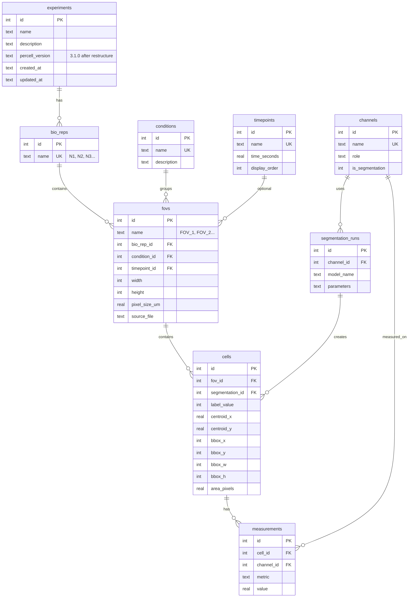

# Data Model Restructure — Bio Rep and FOV

## Overview

Restructure the experiment hierarchy from **condition → region** to **biological replicate → condition → FOV**. This is a large, breaking refactor touching every module.

**Technical replicate grouping** (per-FOV vs pooled) is deferred to a future phase when the statistics module is built. It is not part of this plan.

**New hierarchy:**

```
Experiment
├── N1 (biological replicate)
│   ├── control (condition)
│   │   ├── FOV_1
│   │   └── FOV_2
│   └── treated (condition)
│       └── FOV_1
├── N2
│   ├── control
│   │   └── FOV_1
│   └── treated
│       └── FOV_1
└── N3
    └── ...
```

**Current hierarchy (being replaced):**

```
Experiment
├── control (condition)
│   ├── region1
│   └── region2
└── treated (condition)
    ├── region3
    └── region4
```

**Brainstorm:** `docs/brainstorms/2026-02-17-data-model-bio-rep-fov-restructure-brainstorm.md`

## Problem Statement / Motivation

- **No biological replication support.** The current model has no concept of "which animal/culture did this FOV come from." Statistical analysis requires knowing which observations are biologically independent (big N).
- **Ambiguous terminology.** "Region" is not standard microscopy terminology. FOV (field of view) is what's actually being captured.
- **Report generation.** Publication-quality reports need proper N/n distinction for statistical tables and figure legends.

## Key Design Decisions

| Decision | Choice | Rationale |
|----------|--------|-----------|
| Hierarchy order | Bio Rep > Condition > FOV | Bio rep is the independent unit; conditions within a bio rep are paired |
| Rename | "region" → "FOV" everywhere | Standard microscopy term; clean rename, not an alias |
| Bio rep naming | Auto-numbered N1, N2, N3... | Simple, consistent; identity doesn't need a custom name |
| FOV numbering | Scoped per bio_rep × condition | N1/control/FOV_1 and N2/control/FOV_1 can both exist |
| Default bio rep | N1 created at experiment creation time | Keeps simple experiments simple; bio rep layer invisible until N2+ added |
| Bio rep on import | Auto-created if not exists (matches condition pattern) | `--bio-rep N2` auto-creates N2 if it doesn't exist |
| Bio rep on I/O methods | `bio_rep: str \| None = None` — auto-resolve when 1 bio rep, error when ambiguous | Explicit-over-implicit; prevents silent bugs in multi-bio-rep experiments |
| Table naming | `bio_reps` (not `biological_replicates`) | Consistent with `channels`, `conditions`, `fovs` |
| Migration | Breaking change; re-import required | Alpha app, no external users |
| Tech rep grouping | **Deferred** to future statistics module | YAGNI — build it when the statistics module exists |
| Zarr path stored? | Computed on demand, not stored in DB | `zarr_path` column is already redundant; `_resolve_fov()` recomputes it |
| Timepoint position | `{bio_rep}/{condition}/{timepoint}/{fov}/0` | Deliberate choice: consistent with current `{condition}/{timepoint}/{region}/0` pattern; optimizes for "all FOVs at this timepoint" access |

## Technical Approach

### ERD — New Schema



**Changes from current schema:**
- `regions` table → `fovs` (renamed)
- `cells.region_id` → `cells.fov_id`
- New `bio_reps` table (id, name)
- `fovs.bio_rep_id` FK added
- `fovs.zarr_path` column **dropped** (computed on demand)
- `bio_reps` has no `display_order` (N1 < N2 < N3 sorts naturally)
- `percell_version` bumped to `"3.1.0"`

### Zarr Path Change

| Current | New |
|---------|-----|
| `{condition}/{region}/0` | `{bio_rep}/{condition}/{fov}/0` |
| `{condition}/{timepoint}/{region}/0` | `{bio_rep}/{condition}/{timepoint}/{fov}/0` |
| `{condition}/{region}/labels/0` | `{bio_rep}/{condition}/{fov}/labels/0` |
| `{condition}/{region}/threshold_{ch}/0` | `{bio_rep}/{condition}/{fov}/threshold_{ch}/0` |

**Note:** Timepoint placement (before FOV) is a deliberate design choice matching the current pattern. This optimizes for "all FOVs at timepoint T" access patterns (snapshot comparisons). Time-lapse access (all timepoints for one FOV) requires traversing multiple groups, which is acceptable since snapshot analysis is the primary use case.

### Bio Rep Parameter Design

**Pattern:** `bio_rep: str | None = None` on public methods that take `fov`.

- When `bio_rep is None` and exactly **1** bio rep exists → auto-resolve to that bio rep
- When `bio_rep is None` and **2+** bio reps exist → raise `ValueError("Multiple bio reps exist. Specify bio_rep.")`
- When `bio_rep` is specified → resolve to that bio rep or raise `BioRepNotFoundError`

This keeps simple experiments simple (never mention bio_rep) while making multi-bio-rep experiments explicit and preventing silent bugs.

**Where bio_rep is needed on the public API:**
- `add_fov(..., bio_rep="N1")` — at registration time (required, not optional)
- `get_fovs(bio_rep=None)` — for filtering
- `get_cells(bio_rep=None)` — for cell-level queries

**Where bio_rep is auto-resolved from `_resolve_fov()`:**
- `write_image()`, `read_image()`, `read_image_numpy()`
- `write_labels()`, `read_labels()`
- `write_mask()`, `read_mask()`
- `get_cell_count()`

`_resolve_fov()` looks up the FOV by `(name, condition, timepoint)`, and when the result is ambiguous across bio reps, requires the caller to pass `bio_rep`.

## Implementation Phases

### Phase 1: Rename region → FOV (mechanical refactor)

**Goal:** Pure rename with zero new functionality. All tests pass with updated names.

**Scope:** ~484 region references in tests, ~107 in core source.

**Important:** This is NOT a simple find-and-replace. "region" appears in SQL string literals, dict key strings, and output messages — not just Python identifiers. Each sub-phase must check all three.

#### Phase 1.1: Core Models, Schema & Exceptions

`src/percell3/core/models.py`:

- [ ] Rename `RegionInfo` → `FovInfo`
- [ ] Rename `CellRecord.region_id` → `CellRecord.fov_id`

`src/percell3/core/schema.py`:

- [ ] Rename `regions` table → `fovs`
- [ ] Rename `cells.region_id` → `cells.fov_id`
- [ ] Rename `UNIQUE(region_id, segmentation_id, label_value)` → `UNIQUE(fov_id, ...)`
- [ ] Rename index `idx_cells_region` → `idx_cells_fov`
- [ ] Rename index `idx_regions_condition` → `idx_fovs_condition`
- [ ] Update `EXPECTED_TABLES`: `"regions"` → `"fovs"`
- [ ] Update `EXPECTED_INDEXES`: rename both indexes

`src/percell3/core/exceptions.py`:

- [ ] Rename `RegionNotFoundError` → `FovNotFoundError`

`src/percell3/core/__init__.py`:

- [ ] Update `__all__`: `RegionInfo` → `FovInfo`, `RegionNotFoundError` → `FovNotFoundError`
- [ ] Update import statements

#### Phase 1.2: Queries

`src/percell3/core/queries.py`:

- [ ] `insert_region()` → `insert_fov()`
- [ ] `select_regions()` → `select_fovs()`
- [ ] `select_region_by_name()` → `select_fov_by_name()`
- [ ] `_row_to_region()` → `_row_to_fov()`
- [ ] Update `select_cells()` JOIN: `regions` → `fovs`, `region_name` alias → `fov_name`
- [ ] Update `count_cells()` JOIN: same rename
- [ ] `RegionNotFoundError` import → `FovNotFoundError`
- [ ] Update all SQL string literals: table names, column names, aliases

#### Phase 1.3: Zarr I/O

`src/percell3/core/zarr_io.py`:

- [ ] Rename `_region_group_path()` → `_fov_group_path()`
- [ ] Rename `region` parameter → `fov` in `image_group_path()`, `label_group_path()`, `mask_group_path()`
- [ ] Update all internal `region` variable names → `fov`
- [ ] Update docstrings: "region" → "FOV"

#### Phase 1.4: ExperimentStore

`src/percell3/core/experiment_store.py`:

- [ ] `add_region()` → `add_fov()`
- [ ] `get_regions()` → `get_fovs()`
- [ ] `_resolve_region()` → `_resolve_fov()`
- [ ] Rename `region` parameter to `fov` in: `write_image()`, `read_image()`, `read_image_numpy()`, `write_labels()`, `read_labels()`, `write_mask()`, `read_mask()`, `get_cells()`, `get_cell_count()`, `export_csv()`
- [ ] Update all docstrings
- [ ] Update dict key references: `"region_name"` → `"fov_name"` in downstream code

#### Phase 1.5: IO Module

`src/percell3/io/models.py`:

- [ ] `TokenConfig.region` → `TokenConfig.fov`
- [ ] `ScanResult.regions` → `ScanResult.fovs`
- [ ] `ImportPlan.region_names` → `ImportPlan.fov_names`
- [ ] `ImportResult.regions_imported` → `ImportResult.fovs_imported`

`src/percell3/io/` (all files):

- [ ] Rename all `region` variables, parameters, docstrings → `fov`

`src/percell3/io/__init__.py`:

- [ ] Update exports if applicable

#### Phase 1.6: Segment Module

`src/percell3/segment/`:

- [ ] `SegmentationEngine.run()`: `regions` parameter → `fovs`
- [ ] `SegmentationResult.regions_processed` → `fovs_processed`
- [ ] `SegmentationResult.region_stats` → `fov_stats`
- [ ] `launch_viewer()`: `region` parameter → `fov`
- [ ] `RoiImporter` / `store_labels_and_cells`: `region` → `fov`
- [ ] Update all docstrings and output messages

`src/percell3/segment/__init__.py`:

- [ ] Update exports if applicable

#### Phase 1.7: CLI Module

`src/percell3/cli/`:

- [ ] `--region` flag → `--fov` in all commands (view, segment, query, etc.)
- [ ] `-r` short flag → `-f` for `--fov`
- [ ] Update help text: "region" → "FOV"
- [ ] `query regions` subcommand → `query fovs`
- [ ] Update all Rich console output text
- [ ] Update interactive menu prompts and labels

#### Phase 1.8: Tests

- [ ] Rename all `region` references in test files (~484 occurrences)
- [ ] Update fixture names: `experiment_with_data` region setup → fov setup
- [ ] Run full test suite: all tests must pass

#### Phase 1.9: Verify

- [ ] `grep -rn "region" src/percell3/` returns zero hits (excluding false positives)
- [ ] `grep -rn '".*region.*"' src/percell3/` returns zero string literal hits
- [ ] `grep -rn "'.*region.*'" src/percell3/` returns zero string literal hits
- [ ] `grep -rn "region" tests/` returns zero hits
- [ ] Full test suite passes: `pytest tests/ -v`

---

### Phase 2: Add Biological Replicate Layer

**Goal:** Add `bio_reps` table, wire FOVs to bio reps, update Zarr paths, update schema version.

#### Phase 2.1: Schema Changes

`src/percell3/core/schema.py`:

- [x] Add `bio_reps` table:
  ```sql
  CREATE TABLE IF NOT EXISTS bio_reps (
      id INTEGER PRIMARY KEY,
      name TEXT NOT NULL UNIQUE
  );
  ```
- [x] Add `bio_rep_id` FK to `fovs` table:
  ```sql
  bio_rep_id INTEGER NOT NULL REFERENCES bio_reps(id)
  ```
- [x] Drop `zarr_path` column from `fovs` table (computed on demand by `_resolve_fov()`)
- [x] Update `fovs` UNIQUE constraint: `UNIQUE(name, bio_rep_id, condition_id, timepoint_id)`
- [x] Add index: `idx_fovs_bio_rep ON fovs(bio_rep_id)`
- [x] Update `EXPECTED_TABLES` to include `"bio_reps"`
- [x] Update `EXPECTED_INDEXES` to include `"idx_fovs_bio_rep"`
- [x] Bump `percell_version` to `"3.1.0"` in default INSERT

`src/percell3/core/models.py`:

- [x] Add `bio_rep: str` field to `FovInfo`
- [x] Add `BioRepNotFoundError` to exceptions.py (following `ConditionNotFoundError` pattern)

`src/percell3/core/__init__.py`:

- [x] Export `BioRepNotFoundError`

#### Phase 2.2: Schema Creation — Default N1

`src/percell3/core/schema.py`:

- [x] In `create_schema()`, after inserting experiment row, insert default bio rep:
  ```python
  conn.execute("INSERT INTO bio_reps (name) VALUES ('N1')")
  ```

#### Phase 2.3: Queries — Bio Rep Functions

`src/percell3/core/queries.py`:

- [x] `insert_bio_rep(conn, name) -> int` — INSERT with IntegrityError → DuplicateError handling
- [x] `select_bio_reps(conn) -> list[Row]` — SELECT ordered by name
- [x] `select_bio_rep_by_name(conn, name) -> Row` — SELECT with BioRepNotFoundError
- [x] `select_bio_rep_id(conn, name) -> int` — resolve name to id
- [x] Update `insert_fov()`: add `bio_rep_id` parameter, include in INSERT
- [x] Update `insert_fov()`: NULL-aware duplicate check must include `bio_rep_id` in WHERE clause (SQLite NULLs are distinct in UNIQUE)
- [x] Update `select_fovs()`: JOIN `bio_reps`, include `bio_rep_name` in results, accept optional `bio_rep_id` filter
- [x] Update `select_cells()`: JOIN through `fovs` → `bio_reps`, include `bio_rep_name` in result dicts
- [x] Update `count_cells()`: same JOIN update
- [x] Update `get_measurement_pivot()`: include `bio_rep_name` column in output

#### Phase 2.4: ExperimentStore — Bio Rep Methods

`src/percell3/core/experiment_store.py`:

- [x] `add_bio_rep(name: str) -> int` — call `_validate_name(name, "bio_rep name")` as FIRST line, then delegate to `queries.insert_bio_rep()`
- [x] `get_bio_reps() -> list[str]` — return bio rep names (simple list, like `get_conditions()`)
- [x] `get_bio_rep(name: str) -> int` — return bio rep id, raise BioRepNotFoundError if not found
- [x] `_resolve_bio_rep(name: str | None) -> int` — auto-resolve when 1 bio rep, error when ambiguous
- [x] Update `add_fov()` signature: add `bio_rep: str` parameter (required, no default — caller must specify)
- [x] Update `add_fov()` to resolve bio_rep → id and include `bio_rep_id` in INSERT
- [x] Update `get_fovs()` to accept optional `bio_rep` filter, optional `condition` filter, optional `timepoint` filter
- [x] Update `_resolve_fov()`: accept `bio_rep: str | None = None`, auto-resolve when 1 bio rep, error when ambiguous and None
- [x] Update `_resolve_fov()` to compute zarr path (no longer read from DB)
- [x] Update I/O methods (`write_image`, `read_image`, `read_image_numpy`, `write_labels`, `read_labels`, `write_mask`, `read_mask`): add `bio_rep: str | None = None`, pass through to `_resolve_fov()`
- [x] Update `get_cells()`, `get_cell_count()`: add optional `bio_rep` filter
- [ ] Add version check to `open()`: compare `percell_version` against expected, raise clear error for old experiments

#### Phase 2.5: Zarr Paths — Add Bio Rep Prefix

`src/percell3/core/zarr_io.py`:

- [x] Update `_fov_group_path()` to accept `bio_rep` parameter:
  ```python
  def _fov_group_path(
      bio_rep: str,
      condition: str,
      fov: str,
      timepoint: str | None = None,
  ) -> str:
      if timepoint:
          return f"{bio_rep}/{condition}/{timepoint}/{fov}"
      return f"{bio_rep}/{condition}/{fov}"
  ```
- [x] Update `image_group_path()`, `label_group_path()`, `mask_group_path()` signatures
- [x] Update all callers in `ExperimentStore`

#### Phase 2.6: IO Module — Bio Rep Assignment

`src/percell3/io/models.py`:

- [x] Add `bio_rep: str = "N1"` field to `ImportPlan`

`src/percell3/io/engine.py`:

- [x] Auto-create bio rep if it doesn't exist (matching condition auto-create pattern at lines 85-99):
  ```python
  # Auto-create bio rep if not exists
  existing_bio_reps = store.get_bio_reps()
  if plan.bio_rep not in existing_bio_reps:
      store.add_bio_rep(plan.bio_rep)
  ```
- [x] Pass `bio_rep` through import pipeline to `add_fov()` calls
- [x] Apply `sanitize_name()` to bio_rep input from CLI before store calls

#### Phase 2.7: CLI — Bio Rep Flag

`src/percell3/cli/`:

- [x] Add `--bio-rep` / `-b` flag to `import` command (default `"N1"`)
- [x] Add `--bio-rep` / `-b` flag to `view`, `segment` commands (default `None` — auto-resolve)
- [x] Add `query bio-reps` subcommand
- [x] Update `query fovs` to show bio_rep column
- [x] Update interactive menu: show bio rep selection prompt when N2+ exists, skip when only N1
- [x] When only N1 exists, auto-select it (invisible bio rep layer)

#### Phase 2.8: Segment & Viewer

`src/percell3/segment/_engine.py`:

- [x] Add `bio_rep: str | None = None` parameter to `SegmentationEngine.run()`
- [x] Pass `bio_rep` to `get_fovs()` for filtering
- [ ] Progress callback format: `"Segmenting N1/control/FOV_1"` when N2+ exists

`src/percell3/segment/viewer/`:

- [ ] Add `bio_rep: str | None = None` parameter to `launch_viewer()`
- [ ] Pass through to store I/O methods

`src/percell3/segment/roi_import.py`:

- [x] Update `RoiImporter` / `store_labels_and_cells` to accept `bio_rep`

#### Phase 2.9: Security Verification

- [x] `_validate_name()` called in `add_bio_rep()` as FIRST operation
- [x] `sanitize_name()` applied to `--bio-rep` CLI input in import pipeline
- [x] All new SQL queries use parameterized `?` placeholders
- [x] `BioRepNotFoundError` raised on missing bio rep
- [x] `DuplicateError` raised on duplicate bio rep insertion
- [x] NULL-aware duplicate check in `insert_fov()` includes `bio_rep_id`
- [x] Unit tests: path traversal (`../evil`, `N1/../N2`), empty string, slashes, null bytes
- [x] Grep for hexagonal boundary violations:
  ```bash
  grep -r 'store\._[a-z]' src/percell3/{io,segment,measure,plugins,workflow,cli}/ --include="*.py" | grep -v "self._"
  ```

#### Phase 2.10: Tests

- [x] Add tests for `add_bio_rep()`, `get_bio_reps()`, `get_bio_rep()`
- [x] Add tests for default N1 creation at experiment creation
- [x] Test `add_fov()` with explicit bio_rep
- [x] Test `get_fovs()` bio_rep filtering
- [ ] Test `get_fovs()` with combined bio_rep + condition + timepoint filters
- [x] Test Zarr paths include bio_rep prefix
- [ ] Test import with `--bio-rep N1` (default) and `--bio-rep N2` (auto-creates)
- [x] Test auto-select N1 when it's the only bio rep
- [x] Test `_resolve_fov()` raises ValueError when N2+ exists and bio_rep is None
- [x] Test `select_cells()` returns bio_rep_name in results
- [x] Test `get_measurement_pivot()` includes bio_rep column
- [ ] Test schema version check rejects old experiments
- [x] Security tests: path traversal, empty names, duplicate bio reps
- [x] Full test suite passes (542 tests)

---

### Phase 3: Configurable Tech Rep Grouping (DEFERRED)

**Deferred until the statistics/measure module is built.** The `TechRepMode` enum (per-FOV vs pooled) is an analysis-time concern, not a data model concern. Building it now is YAGNI.

When the time comes, this phase will:
- Define a `TechRepMode` enum with string values (`"per-fov"`, `"pooled"`) for CLI round-tripping
- Add grouping to `get_measurement_pivot()` and `export_csv()`
- Specify aggregation functions (mean, etc.)
- Address timepoint interaction: whether each `(bio_rep, condition, fov, timepoint)` is the atomic unit, or whether timepoints are also pooled
- Add `--tech-rep` CLI flag to export command

---

## Blast Radius Summary

| Module | Files Affected | Estimated Changes |
|--------|---------------|-------------------|
| `core/models.py` | 1 | Rename `RegionInfo` → `FovInfo`, add `bio_rep` field |
| `core/schema.py` | 1 | Rename table + columns, add `bio_reps` table, drop `zarr_path` |
| `core/queries.py` | 1 | Rename all region query functions + new bio rep functions |
| `core/zarr_io.py` | 1 | Rename params, update path construction |
| `core/experiment_store.py` | 1 | ~50 method/param renames + ~10 new methods |
| `core/exceptions.py` | 1 | Rename error class + add `BioRepNotFoundError` |
| `core/__init__.py` | 1 | Update exports |
| `io/models.py` | 1 | Rename fields, add `bio_rep` |
| `io/*.py` | ~4 | Rename region → fov, thread bio_rep |
| `segment/*.py` | ~3 | Rename region → fov, add bio_rep param to engine + viewer |
| `cli/*.py` | ~6 | Rename flags, add `--bio-rep` / `-b`, update output |
| `tests/` | ~20 | ~484 region reference renames + new bio rep tests |
| **Total** | ~41 files | ~700+ line changes |

## Acceptance Criteria

### Phase 1

- [ ] Zero occurrences of "region" in `src/percell3/` (identifiers AND string literals)
- [ ] Zero occurrences of "region" in `tests/`
- [ ] All existing tests pass with renamed identifiers
- [ ] `FovInfo` dataclass works identically to old `RegionInfo`
- [ ] CLI help shows `--fov` / `-f` instead of `--region` / `-r`
- [ ] `__init__.py` exports updated

### Phase 2

- [ ] `bio_reps` table exists in new experiments
- [ ] Default `N1` bio rep created automatically at experiment creation
- [ ] FOVs linked to bio reps via FK
- [ ] `zarr_path` column does not exist on `fovs` table (computed on demand)
- [ ] Zarr paths include bio rep prefix: `N1/control/FOV_1/0`
- [ ] Import with `--bio-rep N2` auto-creates N2 if it doesn't exist
- [ ] `query bio-reps` lists all bio reps
- [ ] Bio rep layer invisible in UI when only N1 exists
- [ ] I/O methods auto-resolve bio rep when only 1 exists
- [ ] I/O methods raise ValueError when N2+ exists and bio_rep not specified
- [ ] `select_cells()` and `get_measurement_pivot()` include bio_rep_name
- [ ] Schema version is `"3.1.0"`, old experiments raise clear error on open
- [ ] `_validate_name()` on `add_bio_rep()` passes security tests

## Dependencies & Risks

**Dependencies:**

- Phase 2 depends on Phase 1 (rename must be complete first)
- Phase 3 (deferred) depends on Phase 2 + statistics module

**Risks:**

- **Large blast radius.** Touching ~41 files with ~700+ changes. Mitigation: Phase 1 is purely mechanical (rename + verify tests) which reduces risk.
- **Zarr path change breaks existing experiments.** Mitigation: Accepted as breaking change (alpha app). Schema version bump + check in `open()` gives clear error.
- **Test count.** 484 region references in tests to rename. Mitigation: Systematic rename with 3-way grep verification (identifiers, double-quoted strings, single-quoted strings).
- **String literal renames.** SQL strings, dict keys, and output messages contain "region" that a naive rename won't catch. Mitigation: Explicit string literal grep in Phase 1.9.

## Implementation Notes

**From past solutions (docs/solutions/):**

- `_validate_name()` must be applied to `add_bio_rep()` as the FIRST operation — prevents path-traversal via bio rep names (documented in `docs/solutions/security-issues/core-module-p1-security-correctness-fixes.md`)
- All new queries must be wrapped in `ExperimentStore` public methods — no raw SQL in other modules (documented in `docs/solutions/architecture-decisions/segment-module-private-api-encapsulation-fix.md`)
- New CLI flags must be tested with both Click `CliRunner` and integration tests (documented in `docs/solutions/integration-issues/cli-io-core-integration-bugs.md`)
- Empty list SQL guards: any query filtering by bio_rep_ids must check `if not ids: return` before building SQL
- NULL-aware duplicate checks: SQLite UNIQUE treats NULLs as distinct — manual `IS NULL` check required in `insert_fov()` for nullable `timepoint_id`
- Dual-mode CLI parity: `--bio-rep` flag and interactive menu prompt must call the same code path

**Design notes:**

- FOV auto-numbering scoped per bio_rep × condition (not global)
- Default N1 created at `create_schema()` time, not lazily
- Bio reps auto-created on import if they don't exist (matching condition pattern)
- `segmentation_runs` table does NOT need bio_rep/fov FK — it remains channel-scoped; cells link runs to FOVs
- Timepoint position in new Zarr path is a deliberate choice: `{bio_rep}/{condition}/{timepoint}/{fov}/0`
- `get_fovs()` accepts three optional filters: `bio_rep`, `condition`, `timepoint`

## Review Findings Incorporated

This plan was updated based on technical review (2026-02-17) with 19 findings from 7 review agents. All findings accepted. Key changes from original plan:

- **bio_rep parameter design**: Changed from `bio_rep="N1"` default to `bio_rep: str | None = None` auto-resolve pattern (todos 070)
- **queries.py added** to Phase 1 and Phase 2 task lists (todo 071)
- **`__init__.py` added** to Phase 1 and Phase 2 task lists (todo 072)
- **Phase 3 deferred** as YAGNI — tech rep grouping belongs in future statistics module (todo 074)
- **zarr_path column dropped** from fovs table — computed on demand (todo 075)
- **SegmentationEngine + viewer** explicit bio_rep parameter specified (todo 076)
- **String literal verification** added to Phase 1.9 (todo 077)
- **select_cells() + get_measurement_pivot()** updated to include bio_rep_name (todo 078)
- **Bio rep auto-creation** on import specified (matching condition pattern) (todo 079)
- **NULL-aware duplicate check** documented for insert_fov() (todo 080)
- **ImportPlan bio_rep field** added (todo 081)
- **`-b` short flag** instead of `-n` for `--bio-rep` (todo 082)
- **display_order removed** from bio_reps table (todo 083)
- **FOV_1** instead of FOV_001 (simpler numbering) (todo 084)
- **Schema version bump** to "3.1.0" with check on open (todo 085)
- **Table name** `bio_reps` instead of `biological_replicates` (todo 086)
- **SegmentationResult fields** enumerated in Phase 1.6 (todo 087)
- **Timepoint interaction** documented in design decisions and deferred Phase 3 (todo 088)

## References

- Brainstorm: `docs/brainstorms/2026-02-17-data-model-bio-rep-fov-restructure-brainstorm.md`
- Current schema: `src/percell3/core/schema.py`
- Current models: `src/percell3/core/models.py`
- Current queries: `src/percell3/core/queries.py`
- Current Zarr paths: `src/percell3/core/zarr_io.py:35-73`
- ExperimentStore: `src/percell3/core/experiment_store.py`
- IO models: `src/percell3/io/models.py`
- Security patterns: `docs/solutions/security-issues/core-module-p1-security-correctness-fixes.md`
- Hexagonal boundary: `docs/solutions/architecture-decisions/segment-module-private-api-encapsulation-fix.md`
- CLI patterns: `docs/solutions/architecture-decisions/cli-module-code-review-findings.md`
