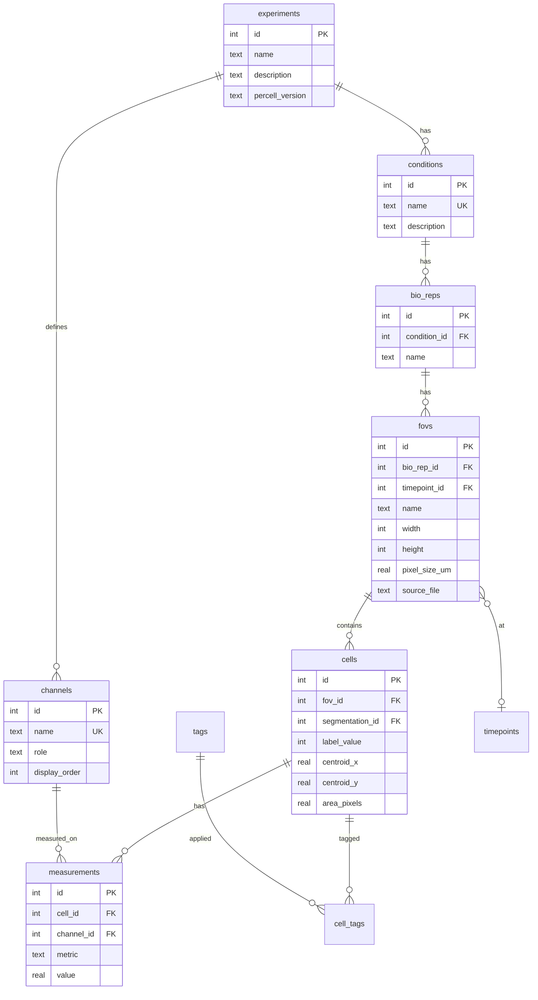

# feat: IO Redesign — Condition > Bio Rep > FOV Hierarchy

## Overview

Restructure PerCell 3's data model and import flow to use a **Condition > Bio Rep > FOV** hierarchy instead of the current flat Bio Rep + Condition → FOV model. This is a clean-break schema change with no migration. The import flow is rebuilt as a table-first interactive assignment where users see file groups and assign metadata in bulk.

**Single-cell focus**: Every decision serves the goal of tracking Experiment → Condition → Bio Rep → FOV → Cell → Measurement as the explicit hierarchy for single-cell analysis.

## Problem Statement

1. **Hierarchy is inverted**: Current zarr paths are `{bio_rep}/{condition}/{fov}` but conditions are the primary experimental grouping. Bio reps should be nested under conditions.
2. **Bio reps are global**: `bio_reps` table has `UNIQUE(name)`, meaning "N1" is shared across all conditions. But conditions can have uneven numbers of replicates (A has 3 reps, B has 1), which is awkward with a global bio_rep.
3. **Import flow is cumbersome**: Users must assign condition → FOV group-by-group. No batch selection, no context-aware prompts for existing experiments.
4. **Bio rep prompt timing is wrong**: Prompted once per session before any condition assignment. Users can't assign different bio reps to different conditions in one import.

## Proposed Solution

### Schema Change: Bio Reps Scoped Per Condition

```sql
CREATE TABLE bio_reps (
    id INTEGER PRIMARY KEY,
    condition_id INTEGER NOT NULL REFERENCES conditions(id),
    name TEXT NOT NULL DEFAULT 'N1',
    UNIQUE(condition_id, name)
);

CREATE TABLE fovs (
    id INTEGER PRIMARY KEY,
    name TEXT NOT NULL,
    bio_rep_id INTEGER NOT NULL REFERENCES bio_reps(id),
    timepoint_id INTEGER REFERENCES timepoints(id),
    width INTEGER,
    height INTEGER,
    pixel_size_um REAL,
    source_file TEXT,
    UNIQUE(name, bio_rep_id, timepoint_id)
);
```

Key changes:
- `bio_reps` gets `condition_id` FK — "N1/control" and "N1/treated" are separate rows
- `fovs` drops `condition_id` — condition is derivable through `bio_rep.condition_id`
- `fovs` UNIQUE constraint becomes `(name, bio_rep_id, timepoint_id)`
- Default bio rep "N1" is created per-condition, not globally

### Zarr Path Change

```
Old: {bio_rep}/{condition}/[{timepoint}/]{fov}
New: {condition}/{bio_rep}/[{timepoint}/]{fov}
```

### Table-First Interactive Import

```
Scanned: /Volumes/NX-01-A/2026-02-17_export/

  #  File group              Ch  Z   Files
  1  30min_Recovery_Merged     3  4    12
  2  1hr_Recovery_Merged       3  4    12
  3  Untreated_Merged          3  4    12

Select groups (space-separated, 'all'): 1 2
Condition: treated
  → existing conditions: [1] control  [2] (new condition)
Bio replicate [N1]: N1
→ Assigned 2 groups to 'treated / N1' as FOV_001, FOV_002

  #  File group              Ch  Z   Files  Condition  Rep
  1  30min_Recovery_Merged     3  4    12   treated    N1
  2  1hr_Recovery_Merged       3  4    12   treated    N1
  3  Untreated_Merged          3  4    12   —

Select groups (space-separated, 'all', 'done'):
```

### Context-Aware "Add to Existing" Flow

When experiment already has data and user picks an existing condition:
```
Condition 'control' already has data:
  N1: 3 FOVs (FOV_001 – FOV_003)

What to do?
  [1] Add new bio replicate (N2)
  [2] Add more FOVs to N1
  [3] Add more FOVs to a different bio rep
```

## Technical Approach

### ERD



### Implementation Phases

#### Phase 1: Core Schema + Data Model (`schema.py`, `models.py`, `queries.py`)

**`src/percell3/core/schema.py`**

- [x] Change `bio_reps` table: add `condition_id INTEGER NOT NULL REFERENCES conditions(id)`, change UNIQUE to `UNIQUE(condition_id, name)`
- [x] Change `fovs` table: remove `condition_id` column, change UNIQUE to `UNIQUE(name, bio_rep_id, timepoint_id)`
- [x] Remove `idx_fovs_condition` index (condition is on bio_reps now)
- [x] Add `idx_bio_reps_condition` index on `bio_reps(condition_id)`
- [x] Remove auto-insert of default "N1" bio rep from `create_schema()` — bio reps are now per-condition
- [x] Bump `EXPECTED_VERSION` to `"3.2.0"`
- [x] Update `EXPECTED_TABLES` and `EXPECTED_INDEXES`

**`src/percell3/core/models.py`**

- [x] Remove `DEFAULT_BIO_REP` constant (bio reps are per-condition, default created on demand)
- [x] Update `FovInfo` dataclass — condition is still present (derived from query JOINs) but no longer a direct FK

**`src/percell3/core/queries.py`**

- [x] Update `insert_bio_rep()` — add `condition_id` parameter
- [x] Update `select_bio_reps()` — add optional `condition_id` filter
- [x] Update `select_bio_rep_by_name()` — require `condition_id` parameter for scoped lookup
- [x] Add `select_bio_rep_id()` — convenience function
- [x] Update `insert_fov()` — remove `condition_id` parameter (derived from bio_rep)
- [x] Update `select_fovs()` — JOIN through `bio_reps` to get condition; `condition_id` filter JOINs through `bio_reps`
- [x] Update `select_fov_by_name()` — resolve condition through bio_rep chain
- [x] Update `select_cells()` — adjust JOINs (`cells → fovs → bio_reps → conditions`)
- [x] Update `count_cells()` — adjust JOINs
- [ ] Update `count_fovs_for_condition()` — JOIN through bio_reps
- [ ] Update `delete_condition()` — cascade through bio_reps → fovs
- [ ] Update `delete_fov()` — unchanged (still by fov_id)
- [ ] Add `delete_bio_rep()` — cascade: measurements → cell_tags → cells → fovs → bio_rep
- [x] Update rename functions for new FK structure

**Tests: `tests/test_core/test_queries.py`, `tests/test_core/test_experiment_store.py`**

- [x] Update all test fixtures to create bio_reps with condition_id
- [x] Add tests for condition-scoped bio rep operations
- [x] Add tests for cross-condition queries (get_fovs across conditions)
- [x] Update delete/rename tests

#### Phase 2: ExperimentStore + Zarr Paths (`experiment_store.py`, `zarr_io.py`)

**`src/percell3/core/zarr_io.py`**

- [x] Change `_fov_group_path()` from `{bio_rep}/{condition}/{fov}` to `{condition}/{bio_rep}/{fov}`
- [x] Update `mask_group_path()` similarly
- [x] All other zarr_io functions stay the same (they take `group_path` as string)

**`src/percell3/core/experiment_store.py`**

- [x] Update `add_bio_rep(name, condition)` — requires condition name, creates condition-scoped bio_rep
- [x] Add `get_bio_reps(condition)` — returns bio reps for a specific condition
- [x] Update `_resolve_bio_rep(bio_rep, condition)` — resolve within condition scope
- [x] Update `add_fov(name, condition, bio_rep=None)` — resolve bio_rep within condition, default to "N1"
- [x] Auto-create default "N1" bio_rep when adding first FOV to a condition (lazy creation)
- [x] Update `get_fovs(condition, bio_rep)` — filter chain through bio_reps
- [x] Update `_resolve_fov()` — build zarr path with new `{condition}/{bio_rep}/{fov}` order
- [x] Update `rename_condition()` — zarr move is now top-level (condition is root)
- [x] Update `rename_bio_rep()` — zarr move within condition: `{condition}/{old_br}` → `{condition}/{new_br}`
- [x] Update `rename_fov()` — parent prefix changes from `{br}/{condition}` to `{condition}/{br}`
- [x] Update `_move_zarr_children()` — swap bio_rep/condition levels
- [ ] Update `delete_condition()` — zarr delete is now top-level `del root[condition]`
- [ ] Update `delete_fov()` — zarr path construction
- [ ] Update `_delete_zarr_condition()` — simplified: just `del root[condition]`
- [ ] Update `_delete_zarr_group()` — path from `{bio_rep}/{condition}` to `{condition}/{bio_rep}`
- [x] Update `write_image()`, `read_image()`, `write_labels()`, `read_labels()`, `write_mask()`, `read_mask()` — all use `_resolve_fov()` so mostly just need path fix

**Tests: `tests/test_core/test_experiment_store.py`**

- [x] Update all fixtures and assertions for new zarr paths
- [x] Test condition-scoped bio rep creation
- [x] Test auto-creation of default N1 bio rep
- [x] Verify zarr group hierarchy: `condition/bio_rep/fov`

#### Phase 3: IO Engine + ImportPlan (`io/models.py`, `io/engine.py`)

**`src/percell3/io/models.py`**

- [x] Update `ImportPlan`:
  - Kept `bio_rep` as default (simpler approach — bio_rep_map deferred to table-first import)
- [x] Remove `DEFAULT_BIO_REP` import

**`src/percell3/io/engine.py`**

- [x] Update `execute()` — removed global bio rep registration (add_fov handles lazy creation per condition)
- [x] Bio rep registration per condition handled by lazy creation in `store.add_fov()`
- [x] FOV registration already passes bio_rep correctly
- [x] `_existing_cache` works correctly scoped by condition (bio_rep is handled by get_fovs returning [] when non-existent)
- [x] `store.write_image()` calls already pass correct bio_rep

**`src/percell3/io/serialization.py`** (if exists)

- [ ] Update YAML serialization for new ImportPlan fields

**Tests: `tests/test_io/test_engine.py`**

- [x] Update all import tests for condition-scoped bio reps (109 IO tests pass)
- [ ] Test multi-condition import with different bio reps per condition
- [ ] Test incremental import (add N2 to existing condition)

#### Phase 4: Interactive Import Flow (`cli/menu.py`)

**`src/percell3/cli/menu.py`**

- [ ] Rewrite `_import_images()` with new flow:
  1. Get source files (browse/path — existing)
  2. Scan and build file groups (existing `_build_file_groups()`)
  3. Show file groups table (existing `_show_file_groups()`)
  4. **Assignment loop** (per batch):
     a. User selects groups by space-separated numbers / 'all' / 'done'
     b. Prompt condition (existing `_prompt_condition()`)
     c. **New: prompt bio rep** — if condition has data, show existing bio reps + "new bio replicate" + "additional FOVs to existing"; if new condition, default N1
     d. Auto-number FOVs within (condition, bio_rep) scope
     e. Update table display with assignments
  5. Channel rename prompt (existing `_auto_match_channels()`)
  6. Show assignment summary (updated to include bio rep)
  7. Confirm and execute

- [ ] New helper: `_prompt_bio_rep(store, condition)` — shows existing bio reps for condition, offers "new bio replicate" or "additional FOVs"
- [ ] Update `_next_fov_number(store, condition, bio_rep)` — count FOVs in (condition, bio_rep) scope
- [ ] Update `_show_assignment_summary()` — include bio rep column
- [ ] Handle 'b' (back) during assignment: cancel current batch, not entire import
- [ ] Single-group fast path: skip loop, prompt condition + bio rep directly

**Tests: `tests/test_cli/test_menu_import.py`**

- [ ] Update all existing integration tests for new bio rep prompt
- [ ] Add test: existing condition → "new bio replicate" flow
- [ ] Add test: existing condition → "additional FOVs" flow
- [ ] Add test: mixed conditions with different bio reps
- [ ] Add test: 'b' during assignment only cancels current batch

#### Phase 5: CLI Command + Downstream Modules

**`src/percell3/cli/import_cmd.py`**

- [ ] Update `_run_import()` — auto-create bio rep per condition
- [ ] Update FOV auto-numbering to scope by (condition, bio_rep)
- [ ] Update `--bio-rep` flag documentation

**`src/percell3/segment/` (viewer, engine)**

- [ ] Update all calls to `store.get_fovs()`, `store.read_image()`, `store.write_labels()` etc.
- [ ] Viewer: update zarr path construction if directly accessing zarr

**`src/percell3/cli/menu.py` (non-import handlers)**

- [x] Update `_edit_experiment()` — rename bio rep now requires condition selection first
- [x] Update `_query_experiment()` — bio rep query supports condition filter
- [x] Update `_segment_cells()` — pass condition to bio_rep prompt
- [x] Update `_view_napari()` — reordered: select condition before bio_rep

**Tests: full suite**

- [x] Run `pytest tests/ -v` — all 624 tests pass
- [x] Fixed core, IO, CLI, segment, and workflow tests

## Acceptance Criteria

### Functional

- [x] Schema version is 3.2.0 with condition-scoped bio_reps
- [x] `bio_reps` table has `condition_id` FK, `UNIQUE(condition_id, name)`
- [x] `fovs` table has no `condition_id` column; condition derived through bio_rep
- [x] Zarr paths follow `{condition}/{bio_rep}/{fov}` layout
- [ ] Interactive import shows numbered file group table
- [ ] Users can select groups by space-separated numbers, 'all', 'done'
- [ ] Condition prompt shows existing conditions as pick list + "(new condition)"
- [ ] Bio rep prompt shows existing bio reps for chosen condition + "new bio replicate"
- [ ] FOVs auto-number as FOV_001, FOV_002... per (condition, bio_rep) scope
- [ ] Incremental import continues FOV numbering from next available
- [ ] Channel rename prompted once per experiment
- [ ] Assignment summary shows condition + bio rep + FOV mappings before confirmation
- [ ] 'b' during assignment cancels current batch, not entire import
- [x] CLI `percell3 import` works with updated schema

### Non-Functional

- [x] All existing tests updated and passing (624/624)
- [x] New tests for condition-scoped bio rep operations
- [x] No startup performance regression (<500ms for `percell3 --help`)

## Explicitly Deferred

- **Tile position handling** (_sXX tokens as FOVs or stitched) — future phase
- **Timepoint-as-dimension** (time as zarr axis instead of separate entity) — future phase
- **Import undo/reassignment** within assignment loop — future phase
- **Scanning progress indicator** for large directories — future phase
- **Paired experimental designs** (shared bio reps across conditions) — can be added later as a "batch" concept linking bio reps

## Dependencies & Risks

| Risk | Impact | Mitigation |
|------|--------|------------|
| Blast radius across 650+ tests | High | Phase implementation: core first, then IO, then CLI. Run tests after each phase. |
| Zarr path change breaks existing experiments | None | Clean break — no production data. Schema version check rejects old databases. |
| Bio rep scoping breaks paired designs | Low (cell line research, not paired) | Document limitation. Can add "batch" pairing concept later. |
| Query complexity increases with extra JOIN | Low | Condition is always one JOIN away through bio_reps. SQLite handles this efficiently. |

## References

- Brainstorm: `docs/brainstorms/2026-02-18-io-redesign-metadata-assignment-brainstorm.md`
- Previous brainstorm: `docs/brainstorms/2026-02-17-data-model-bio-rep-fov-restructure-brainstorm.md`
- Previous plan (partially implemented): `docs/plans/2026-02-18-feat-redesign-fov-assignment-import-flow-plan.md`
- Solution: `docs/solutions/integration-issues/cli-io-dual-mode-review-fixes.md` — variable shadowing, double-scan prevention
- Solution: `docs/solutions/architecture-decisions/cli-module-code-review-findings.md` — lazy imports, menu-as-dispatcher
- Solution: `docs/solutions/integration-issues/napari-viewer-datamodel-merge-api-conflicts.md` — API change propagation patterns
- CellProfiler input modules: https://cellprofiler-manual.s3.amazonaws.com/CellProfiler-4.0.5/modules/input.html
- OME-Zarr spec: https://ngff.openmicroscopy.org/
