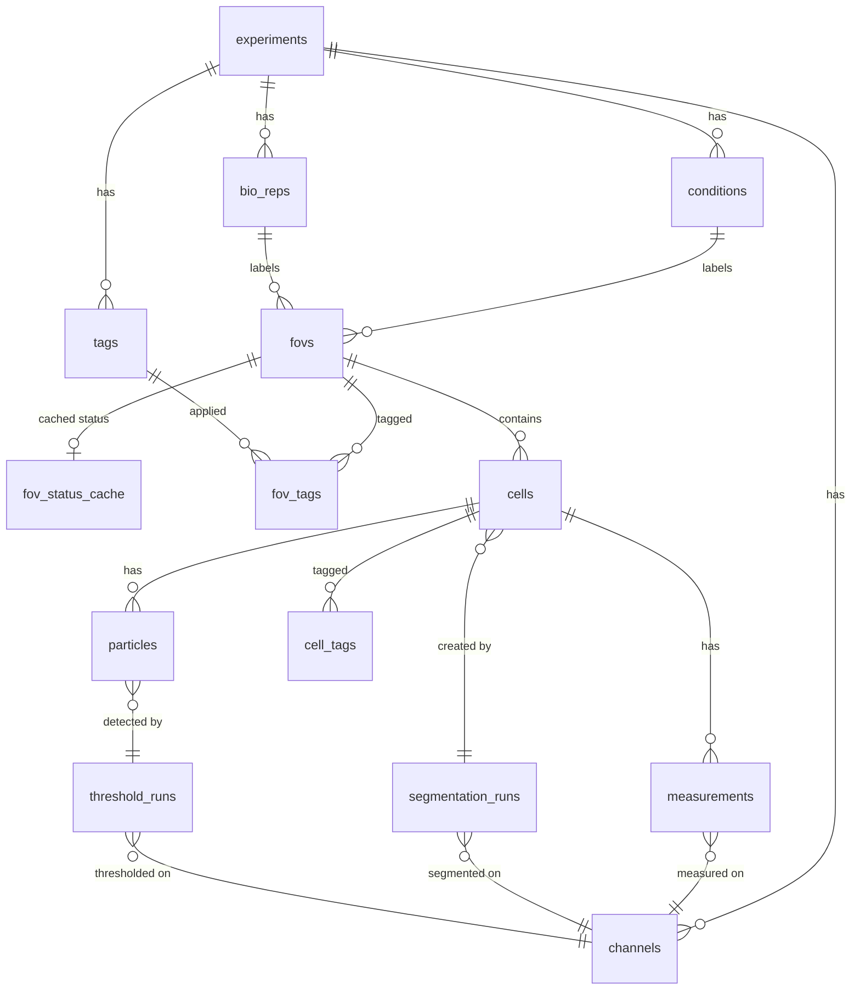

# FOV-Centric Flat Data Model Refactor

## Overview

Restructure PerCell 3's data model from a rigid `condition → bio_rep → FOV` hierarchy to a flat, FOV-centric architecture where each FOV is an independent, globally-identifiable unit of data. Condition, bio_rep, and tech_rep become filterable labels attached to FOVs rather than mandatory structural parents.

This is a **breaking change** affecting the SQLite schema, zarr storage layout, ExperimentStore API (25+ methods), all analysis modules, CLI handlers, and tests. Early-stage development makes this acceptable.

## Problem Statement

The current hierarchy causes recurring issues:

1. **Ambiguity errors**: `"Multiple bio reps exist (1, 2); specify one explicitly"` — code decomposes FOVs by name and fails when names repeat across bio_reps
2. **Brittle API**: Every `read_image()`, `write_labels()`, `write_mask()` requires `(fov_name, condition, bio_rep)` decomposition even when the FOV object is already in hand
3. **Zarr path coupling**: Images at `{condition}/{bio_rep}/{fov}/` — renaming a condition requires physically moving zarr groups
4. **Inconsistent UI**: napari viewer forces hierarchical drill-down while segmentation/measurement/threshold use flat FOV tables
5. **Expensive status queries**: `select_experiment_summary()` does 4-way LEFT JOINs to infer what's been done to each FOV

## Proposed Solution

### New data model

```
fovs (flat, globally unique)
  ├── condition_id → conditions (direct FK, required)
  ├── bio_rep_id → bio_reps (direct FK, required, experiment-global)
  ├── display_name (auto-generated, editable, unique)
  ├── fov_status_cache (fast UI display)
  └── fov_tags → tags (user-defined grouping)
```

### Entity Relationship Diagram



### Key changes from current model

| Aspect | Current | New |
|--------|---------|-----|
| FOV identity | Scoped to `(name, bio_rep_id, timepoint_id)` | Globally unique `fov.id` + unique `display_name` |
| Bio_rep scoping | Scoped to condition (`bio_reps.condition_id NOT NULL`) | Experiment-global (no condition FK) |
| Hierarchy chain | `conditions → bio_reps → fovs` | `fovs` has direct FKs to both `conditions` and `bio_reps` |
| Zarr paths | `{condition}/{bio_rep}/{fov}/` | `fov_{id}/` |
| API pattern | `store.read_image(fov, condition, channel, bio_rep=...)` | `store.read_image(fov_id, channel)` |
| Status tracking | JOIN-based inference only | Status cache table + JOIN inference as source of truth |
| FOV grouping | Only by condition/bio_rep | + user-defined tags via `fov_tags` |

## Implementation Phases

### Phase 1: Schema + Models (Foundation)

**Files:**
- `src/percell3/core/schema.py`
- `src/percell3/core/models.py`

#### 1a. Update SQLite schema (`schema.py`)

Bump `EXPECTED_VERSION` to `"3.4.0"`.

**`bio_reps` table — remove condition scoping:**
```sql
CREATE TABLE IF NOT EXISTS bio_reps (
    id INTEGER PRIMARY KEY,
    name TEXT NOT NULL UNIQUE  -- was UNIQUE(condition_id, name)
);
-- DROP: condition_id column entirely
-- DROP: idx_bio_reps_condition index
```

**`fovs` table — flatten with direct FKs + display_name:**
```sql
CREATE TABLE IF NOT EXISTS fovs (
    id INTEGER PRIMARY KEY,
    display_name TEXT NOT NULL UNIQUE,
    condition_id INTEGER NOT NULL REFERENCES conditions(id),
    bio_rep_id INTEGER NOT NULL REFERENCES bio_reps(id),
    timepoint_id INTEGER REFERENCES timepoints(id),
    width INTEGER,
    height INTEGER,
    pixel_size_um REAL,
    UNIQUE(display_name)
);
-- DROP: name column (replaced by display_name)
-- DROP: bio_rep_id chain to conditions (bio_reps no longer scoped)
-- ADD: condition_id as direct FK
-- Change: bio_rep_id is still FK but to experiment-global bio_reps
```

**New `fov_status_cache` table:**
```sql
CREATE TABLE IF NOT EXISTS fov_status_cache (
    fov_id INTEGER PRIMARY KEY REFERENCES fovs(id) ON DELETE CASCADE,
    cell_count INTEGER NOT NULL DEFAULT 0,
    seg_model TEXT DEFAULT '',
    measured_channels TEXT DEFAULT '',
    masked_channels TEXT DEFAULT '',
    particle_channels TEXT DEFAULT '',
    particle_count INTEGER NOT NULL DEFAULT 0,
    updated_at TEXT NOT NULL DEFAULT (datetime('now'))
);
```

**New `fov_tags` table:**
```sql
CREATE TABLE IF NOT EXISTS fov_tags (
    fov_id INTEGER NOT NULL REFERENCES fovs(id) ON DELETE CASCADE,
    tag_id INTEGER NOT NULL REFERENCES tags(id) ON DELETE CASCADE,
    PRIMARY KEY (fov_id, tag_id)
);
```

**New indexes:**
```sql
CREATE INDEX IF NOT EXISTS idx_fovs_condition ON fovs(condition_id);
CREATE INDEX IF NOT EXISTS idx_fovs_bio_rep ON fovs(bio_rep_id);
CREATE INDEX IF NOT EXISTS idx_fov_tags_fov ON fov_tags(fov_id);
CREATE INDEX IF NOT EXISTS idx_fov_tags_tag ON fov_tags(tag_id);
```

Update `EXPECTED_TABLES` and `EXPECTED_INDEXES` sets.

No migration function needed (breaking change — old experiments won't open).

#### 1b. Update `FovInfo` dataclass (`models.py`)

```python
@dataclass
class FovInfo:
    id: int
    display_name: str
    condition: str        # denormalized from JOIN
    bio_rep: str          # denormalized from JOIN
    timepoint: str | None = None
    width: int | None = None
    height: int | None = None
    pixel_size_um: float | None = None
```

Key change: `display_name` replaces `name`. The `condition` and `bio_rep` fields remain as read-only denormalized values populated by queries.

#### Verification
- [ ] `pytest tests/test_core/test_schema.py -v` — schema creates cleanly
- [ ] New tables appear in `EXPECTED_TABLES`
- [ ] New indexes appear in `EXPECTED_INDEXES`

---

### Phase 2: Zarr Path Helpers

**File:** `src/percell3/core/zarr_io.py`

Replace all 5 path helper functions to use `fov_id`:

```python
def fov_group_path(fov_id: int) -> str:
    """Zarr group path for a FOV's images."""
    return f"fov_{fov_id}"

def image_group_path(fov_id: int) -> str:
    """Zarr group path for a FOV's channel images."""
    return f"fov_{fov_id}"

def label_group_path(fov_id: int) -> str:
    """Zarr group path for a FOV's label image."""
    return f"fov_{fov_id}"

def mask_group_path(fov_id: int, channel: str) -> str:
    """Zarr group path for a FOV's threshold mask."""
    return f"fov_{fov_id}/threshold_{channel}"

def particle_label_group_path(fov_id: int, channel: str) -> str:
    """Zarr group path for a FOV's particle labels."""
    return f"fov_{fov_id}/particles_{channel}"
```

Remove `_fov_group_path()` private helper (absorbed into the public functions).

All downstream read/write functions (`write_image_channel`, `read_image_channel`, etc.) receive `group_path` strings, so they need no changes.

#### Verification
- [ ] `pytest tests/test_core/test_zarr_io.py -v` — all path assertions updated

---

### Phase 3: Query Functions

**File:** `src/percell3/core/queries.py`

This is the largest single file change. Every query that JOINs through the `bio_reps → conditions` chain needs simplification.

#### 3a. Bio_rep queries — remove condition scoping

| Function | Change |
|----------|--------|
| `insert_bio_rep(conn, name, condition_id)` | → `insert_bio_rep(conn, name)` — remove condition_id |
| `select_bio_reps(conn, condition_id=None)` | → `select_bio_reps(conn)` — return all, no filter |
| `select_bio_rep_by_name(conn, name, condition_id=None)` | → `select_bio_rep_by_name(conn, name)` — simple name lookup |
| `select_bio_rep_id(conn, name, condition_id)` | → `select_bio_rep_id(conn, name)` — remove condition_id |
| `rename_bio_rep(conn, old, new, condition_id)` | → `rename_bio_rep(conn, old, new)` — global rename |

#### 3b. FOV queries — flatten JOINs

| Function | Change |
|----------|--------|
| `insert_fov(conn, name, bio_rep_id, ...)` | → `insert_fov(conn, display_name, condition_id, bio_rep_id, ...)` — add condition_id, rename name→display_name |
| `select_fovs(conn, condition_id, bio_rep_id, ...)` | → `select_fovs(conn, condition_id=None, bio_rep_id=None, ...)` — direct column filters, no JOIN through bio_reps |
| `select_fov_by_name(conn, name, condition_id, bio_rep_id, ...)` | → `select_fov_by_id(conn, fov_id)` + `select_fov_by_display_name(conn, display_name)` |
| `_row_to_fov(r)` | Update column aliases: `r["display_name"]`, `r["condition"]`, `r["bio_rep"]` |
| `rename_fov(conn, old, new, condition_id, bio_rep_id)` | → `rename_fov(conn, fov_id, new_display_name)` |

#### 3c. Cell/measurement queries — simplify JOINs

`select_cells()` currently JOINs `cells → fovs → bio_reps → conditions`. Change to:
```sql
SELECT c.*, f.display_name AS fov_name, cond.name AS condition_name,
       b.name AS bio_rep_name, t.name AS timepoint_name
FROM cells c
JOIN fovs f ON c.fov_id = f.id
JOIN conditions cond ON f.condition_id = cond.id
JOIN bio_reps b ON f.bio_rep_id = b.id
LEFT JOIN timepoints t ON f.timepoint_id = t.id
```

Same pattern for `select_particles_with_cell_info()`, `select_experiment_summary()`.

#### 3d. New queries for status cache and tags

```python
def upsert_fov_status_cache(conn, fov_id, cell_count, seg_model,
                             measured_channels, masked_channels,
                             particle_channels, particle_count):
    """Insert or update the status cache for a FOV."""

def select_fov_status_cache(conn):
    """Return all FOV status cache entries."""

def insert_fov_tag(conn, fov_id, tag_id):
    """Tag a FOV."""

def delete_fov_tag(conn, fov_id, tag_id):
    """Remove a tag from a FOV."""

def select_fov_tags(conn, fov_id=None):
    """Get tags for a FOV, or all FOV-tag pairs."""

def select_fovs_by_tag(conn, tag_name):
    """Get all FOVs with a given tag."""
```

#### 3e. Display name generation helper

```python
def generate_display_name(conn, condition_name, bio_rep_name, base_name="FOV"):
    """Generate a unique display name like 'HS_N1_FOV_001'.
    Auto-appends _2, _3, etc. on collision."""
```

#### Verification
- [ ] `pytest tests/test_core/test_queries.py -v` — all query tests updated and passing

---

### Phase 4: ExperimentStore API

**File:** `src/percell3/core/experiment_store.py`

This is the central API change. Every public method switches from `(fov, condition, bio_rep)` to `fov_id`.

#### 4a. Remove hierarchy resolution methods

- Remove `_resolve_bio_rep(self, bio_rep, condition)` — bio_reps are global, just look up by name
- Remove `_resolve_fov(self, fov, condition, bio_rep, timepoint)` — replace with `_get_fov_info(self, fov_id) -> FovInfo`
- Remove `_move_zarr_children()` — zarr paths are `fov_{id}`, renames don't move groups

#### 4b. New internal helper

```python
def _get_fov_info(self, fov_id: int) -> FovInfo:
    """Look up a FOV by ID. Raises FovNotFoundError if not found."""
    return queries.select_fov_by_id(self._conn, fov_id)

def _fov_zarr_path(self, fov_id: int) -> str:
    """Return the zarr group path for a FOV."""
    return zarr_io.fov_group_path(fov_id)
```

#### 4c. API signature changes (all 25+ methods)

**FOV management:**

| Method | Old Signature | New Signature |
|--------|--------------|---------------|
| `add_fov` | `(name, condition, bio_rep=None, ...)` | `(condition, bio_rep=None, display_name=None, ...)` → returns `fov_id`. Auto-generates display_name if not provided. |
| `get_fovs` | `(condition=None, bio_rep=None, timepoint=None)` | `(condition=None, bio_rep=None, timepoint=None, tag=None)` — same filters but direct column queries, not JOINs through chain |
| `delete_cells_for_fov` | `(fov_name, condition)` | `(fov_id)` |
| `delete_particles_for_fov` | `(fov_name, condition)` | `(fov_id)` |

**Bio_rep management:**

| Method | Old Signature | New Signature |
|--------|--------------|---------------|
| `add_bio_rep` | `(name, condition)` | `(name)` — experiment-global |
| `get_bio_reps` | `(condition=None)` | `()` — returns all |

**Image I/O (9 methods):**

| Method | Old Signature | New Signature |
|--------|--------------|---------------|
| `write_image` | `(fov, condition, channel, data, bio_rep=None, timepoint=None)` | `(fov_id, channel, data)` |
| `read_image` | `(fov, condition, channel, bio_rep=None, timepoint=None)` | `(fov_id, channel)` |
| `read_image_numpy` | `(fov, condition, channel, bio_rep=None, timepoint=None)` | `(fov_id, channel)` |
| `write_labels` | `(fov, condition, labels, seg_run_id, bio_rep=None, timepoint=None)` | `(fov_id, labels, seg_run_id)` |
| `read_labels` | `(fov, condition, bio_rep=None, timepoint=None)` | `(fov_id)` |
| `write_mask` | `(fov, condition, channel, mask, threshold_run_id, bio_rep=None, timepoint=None)` | `(fov_id, channel, mask, threshold_run_id)` |
| `read_mask` | `(fov, condition, channel, bio_rep=None, timepoint=None)` | `(fov_id, channel)` |
| `write_particle_labels` | `(fov, condition, channel, labels, bio_rep=None, timepoint=None)` | `(fov_id, channel, labels)` |
| `read_particle_labels` | `(fov, condition, channel, bio_rep=None, timepoint=None)` | `(fov_id, channel)` |

**Query/export methods:**

| Method | Old Signature | New Signature |
|--------|--------------|---------------|
| `get_cells` | `(condition=None, bio_rep=None, fov=None, ...)` | `(fov_id=None, condition=None, ...)` — fov_id is the primary filter |
| `get_cell_count` | `(condition=None, bio_rep=None, fov=None, ...)` | `(fov_id=None, condition=None, ...)` |

**Rename operations:**

| Method | Old Signature | New Signature |
|--------|--------------|---------------|
| `rename_condition` | `(old, new)` | `(old, new)` — same, but no zarr group moves needed. Update display_names of affected FOVs. |
| `rename_bio_rep` | `(old, new, condition=None)` | `(old, new)` — no condition scoping. Update display_names. |
| `rename_fov` | `(old, new, condition, bio_rep=None)` | `(fov_id, new_display_name)` |

**New methods:**

```python
def get_fov_by_id(self, fov_id: int) -> FovInfo:
    """Get a single FOV by ID."""

def update_fov_status_cache(self, fov_id: int) -> None:
    """Refresh the status cache for a FOV by querying actual data."""

def refresh_all_status_cache(self) -> None:
    """Refresh status cache for all FOVs. Called on experiment open."""

def add_fov_tag(self, fov_id: int, tag_name: str) -> None:
    """Tag a FOV. Creates the tag if it doesn't exist."""

def remove_fov_tag(self, fov_id: int, tag_name: str) -> None:
    """Remove a tag from a FOV."""

def get_fov_tags(self, fov_id: int) -> list[str]:
    """Get all tags for a FOV."""
```

#### 4d. Status cache update triggers

After these operations, call `update_fov_status_cache(fov_id)`:
- `add_cells()` (after segmentation)
- `delete_cells_for_fov()`
- `add_measurements()`
- `add_particles()`
- `delete_particles_for_fov()`

#### Verification
- [ ] `pytest tests/test_core/test_experiment_store.py -v` — all store tests updated and passing

---

### Phase 5: Core Tests

**Files:**
- `tests/test_core/test_schema.py`
- `tests/test_core/test_zarr_io.py`
- `tests/test_core/test_queries.py`
- `tests/test_core/test_experiment_store.py`

Rewrite all test fixtures to use the new API:

**Old fixture pattern:**
```python
store.add_condition("control")
store.add_fov("r1", "control", bio_rep="N1")
store.write_image("r1", "control", "DAPI", data, bio_rep="N1")
```

**New fixture pattern:**
```python
store.add_condition("control")
store.add_bio_rep("N1")
fov_id = store.add_fov("control", bio_rep="N1")  # returns ID
store.write_image(fov_id, "DAPI", data)
```

**New test categories to add:**
- `TestFovStatusCache` — verify cache updates after segmentation, measurement, threshold
- `TestFovTags` — add/remove/query tags on FOVs
- `TestDisplayNameGeneration` — auto-generation, collision handling, uniqueness
- `TestFlatBioReps` — verify bio_reps are experiment-global

#### Verification
- [ ] `pytest tests/test_core/ -v` — all core tests pass

---

### Phase 6: Segment Module

**Files:**
- `src/percell3/segment/_engine.py`
- `src/percell3/segment/roi_import.py`
- `src/percell3/segment/viewer/_viewer.py`
- `src/percell3/segment/viewer/cellpose_widget.py`

All methods switch from `(fov, condition, bio_rep)` to `fov_id`. Key changes:

**`_engine.py` — `SegmentationEngine.run()`:**
- Change: `store.read_image_numpy(fov_info.name, fov_info.condition, channel, bio_rep=fov_info.bio_rep)` → `store.read_image_numpy(fov_info.id, channel)`
- Change: `store.write_labels(fov_info.name, fov_info.condition, ...)` → `store.write_labels(fov_info.id, ...)`

**`roi_import.py` — `store_labels_and_cells()`:**
- Remove `fov`, `condition`, `bio_rep` params. Accept `fov_id` only.
- All internal store calls use `fov_id`.

**`viewer/_viewer.py` — `_launch()` and channel loading:**
- Accept `fov_id` instead of `(fov, condition, bio_rep)`.
- All `store.read_image()`, `store.read_labels()`, `store.read_mask()` calls use `fov_id`.

**`cellpose_widget.py`:**
- Store `self._fov_id` and `self._fov_info` instead of `self._fov`, `self._condition`, `self._bio_rep`.
- All store calls use `self._fov_id`.

#### Verification
- [ ] `pytest tests/test_segment/ -v` — all segment tests pass

---

### Phase 7: Measure Module

**Files:**
- `src/percell3/measure/measurer.py`
- `src/percell3/measure/batch.py`
- `src/percell3/measure/cell_grouper.py`
- `src/percell3/measure/thresholding.py`
- `src/percell3/measure/particle_analyzer.py`

Same pattern — all methods switch from `(fov, condition, bio_rep)` to `fov_id`:

| Method | Key Change |
|--------|-----------|
| `Measurer.measure_fov()` | `(store, fov_id, channels, ...)` — all read calls use fov_id |
| `Measurer.measure_cells()` | `(store, cell_ids, fov_id, channel, ...)` |
| `Measurer.measure_fov_masked()` | `(store, fov_id, channels, ...)` |
| `BatchMeasurer.measure_experiment()` | Iterates FOVs, passes `fov_info.id` |
| `CellGrouper.group_cells()` | `(store, fov_id, channel, metric, ...)` |
| `threshold_fov()` | `(store, fov_id, channel, ...)` |
| `threshold_group()` | `(store, fov_id, channel, ...)` |
| `ParticleAnalyzer.analyze_fov()` | `(store, fov_id, channel, ...)` |

#### Verification
- [ ] `pytest tests/test_measure/ -v` — all measure tests pass

---

### Phase 8: IO Module

**Files:**
- `src/percell3/io/engine.py`
- `src/percell3/io/models.py`
- `src/percell3/io/serialization.py`

**`ImportPlan` (`models.py`):**
Keep `condition` and `bio_rep` fields — these are metadata to store on the FOV record. Remove `condition_map` and `bio_rep_map` dicts (simplified since the hierarchy chain is broken).

**`ImportEngine` (`engine.py`):**
- `add_fov()` call changes: `store.add_fov(condition=condition, bio_rep=bio_rep)` → returns `fov_id`
- `write_image()` call changes: `store.write_image(fov_id, channel, data)`
- FOV duplicate detection changes: query by display_name instead of `(name, condition, bio_rep)`
- FOV numbering: generate sequential display names globally per `(condition, bio_rep)` prefix

#### Verification
- [ ] `pytest tests/test_io/ -v` — all IO tests pass

---

### Phase 9: CLI Handlers

**Files:**
- `src/percell3/cli/menu.py`
- `src/percell3/cli/import_cmd.py`
- `src/percell3/cli/export.py`
- `src/percell3/cli/query.py`

Every handler that passes `(fov_info.name, fov_info.condition, fov_info.bio_rep)` to store/module methods changes to pass `fov_info.id`.

**Key handler changes in `menu.py`:**

| Handler | Change |
|---------|--------|
| `_segment_cells()` | Pass `fov_info.id` to `engine.run()` and `measurer.measure_fov()` |
| `_view_napari()` | Remove condition→bio_rep→FOV drill-down. Show flat FOV table, pass `fov_info.id` to `launch_viewer()` |
| `_measure_whole_cell()` | Pass `fov_info.id` to `measurer.measure_fov()` |
| `_measure_masked()` | Pass `fov_info.id` to `measurer.measure_fov_masked()` |
| `_apply_threshold()` | Pass `fov_info.id` to all grouper/threshold/analyzer calls |
| `_import_images()` | Update assignment flow for flat model |
| `_query_experiment()` | Display flat FOV table with condition/bio_rep columns |
| `_edit_experiment()` | Rename operations use `fov_id` or global scope |
| `_export_csv()` | Minimal changes — export already queries globally |

**`_show_fov_status_table()` — use status cache:**
Read from `fov_status_cache` instead of computing status via JOINs. Faster display. Add `display_name` column, keep condition/bio_rep columns for context.

**napari viewer flow:** Change from condition→bio_rep→FOV drill-down to flat FOV table selection (same table used by segmentation/measurement).

#### Verification
- [ ] `pytest tests/test_cli/ -v` — all CLI tests pass

---

### Phase 10: Test Fixtures and Remaining Tests

**Files:**
- `tests/test_cli/conftest.py`
- `tests/test_measure/conftest.py`
- All test files with hierarchy-based fixtures

Update all shared fixtures to use new API pattern. Ensure all 769+ tests pass.

#### Verification
- [ ] `pytest tests/ -v` — full test suite passes

---

## Files Changed Summary

| File | Impact | Changes |
|------|--------|---------|
| `src/percell3/core/schema.py` | HIGH | New DDL, new tables, new indexes, version bump |
| `src/percell3/core/models.py` | LOW | `FovInfo.display_name`, field renames |
| `src/percell3/core/zarr_io.py` | HIGH | All 5 path helpers rewritten |
| `src/percell3/core/queries.py` | HIGH | 15+ functions refactored, 6+ new functions |
| `src/percell3/core/experiment_store.py` | HIGH | 25+ methods new signatures, new methods added |
| `src/percell3/segment/_engine.py` | MEDIUM | 1 method, ~5 call sites |
| `src/percell3/segment/roi_import.py` | MEDIUM | 3 functions, ~8 call sites |
| `src/percell3/segment/viewer/_viewer.py` | MEDIUM | 5 functions, ~10 call sites |
| `src/percell3/segment/viewer/cellpose_widget.py` | MEDIUM | 3 methods, ~6 call sites |
| `src/percell3/measure/measurer.py` | MEDIUM | 3 methods, ~10 call sites |
| `src/percell3/measure/batch.py` | MEDIUM | 1 method, ~3 call sites |
| `src/percell3/measure/cell_grouper.py` | MEDIUM | 1 method, ~2 call sites |
| `src/percell3/measure/thresholding.py` | MEDIUM | 2 methods, ~6 call sites |
| `src/percell3/measure/particle_analyzer.py` | MEDIUM | 1 method, ~8 call sites |
| `src/percell3/io/engine.py` | MEDIUM | Import flow, ~6 call sites |
| `src/percell3/io/models.py` | LOW | `ImportPlan` field changes |
| `src/percell3/io/serialization.py` | LOW | YAML field names |
| `src/percell3/cli/menu.py` | HIGH | 12+ handlers, FOV table display |
| `src/percell3/cli/import_cmd.py` | MEDIUM | Import flow, FOV numbering |
| `src/percell3/cli/export.py` | LOW | Minimal — export queries globally |
| `src/percell3/cli/query.py` | LOW | Column names in output |
| `tests/test_core/*.py` | HIGH | Nearly all tests rewritten |
| `tests/test_cli/conftest.py` | HIGH | All fixtures rewritten |
| `tests/test_measure/conftest.py` | HIGH | All fixtures rewritten |

**No changes needed:**
- `src/percell3/io/_sanitize.py`
- `src/percell3/segment/label_processor.py`
- `src/percell3/segment/base_segmenter.py`
- `src/percell3/segment/cellpose_adapter.py`

## Institutional Learnings to Apply

From `docs/solutions/integration-issues/napari-viewer-datamodel-merge-api-conflicts.md`:
- **Run full test suite after each phase**, not just the module's tests. API changes cascade across modules.
- **Update all call sites in a single commit per phase** so git blame is clear.

From `docs/solutions/architecture-decisions/segment-module-private-api-encapsulation-fix.md`:
- **Never import `queries` or `zarr_io` from outside `core/`**. All access through `ExperimentStore` public API.
- Verify with: `grep -r 'from percell3.core import queries' src/percell3/{io,segment,measure,cli}/`

From `docs/solutions/design-gaps/import-flow-table-first-ui-and-heuristics.md`:
- **Test with real microscope filenames**, not just synthetic patterns.

## Acceptance Criteria

### Functional
- [ ] FOVs have globally unique integer IDs used by all API methods
- [ ] FOVs have auto-generated display_names that are unique and editable
- [ ] Bio_reps are experiment-global (not scoped to conditions)
- [ ] Zarr images stored at `fov_{id}/` path
- [ ] Status cache table updated after segmentation, measurement, thresholding
- [ ] FOV tags can be created, applied, removed, and filtered
- [ ] All CLI handlers use fov_id for store/module calls
- [ ] napari viewer uses flat FOV selection (no hierarchical drill-down)
- [ ] Renaming a condition or bio_rep is a DB-only operation (no zarr moves)
- [ ] Export CSV still includes condition_name, bio_rep_name columns

### Quality
- [ ] All 769+ existing tests pass (rewritten for new API)
- [ ] New tests for: fov_status_cache, fov_tags, display_name generation, flat bio_reps
- [ ] No module imports `queries` or `zarr_io` from outside `core/`
- [ ] `pytest tests/ -v` — zero failures

## Verification

- [ ] `pytest tests/test_core/ -v` — core module tests
- [ ] `pytest tests/test_segment/ -v` — segmentation tests
- [ ] `pytest tests/test_measure/ -v` — measurement tests
- [ ] `pytest tests/test_io/ -v` — IO tests
- [ ] `pytest tests/test_cli/ -v` — CLI tests
- [ ] `pytest tests/ -v` — full suite
- [ ] Manual: `percell3` shows FOV table with display_name, condition, bio_rep columns
- [ ] Manual: Segmentation, measurement, thresholding work with fov_id-based API
- [ ] Manual: napari viewer launches with flat FOV selection
