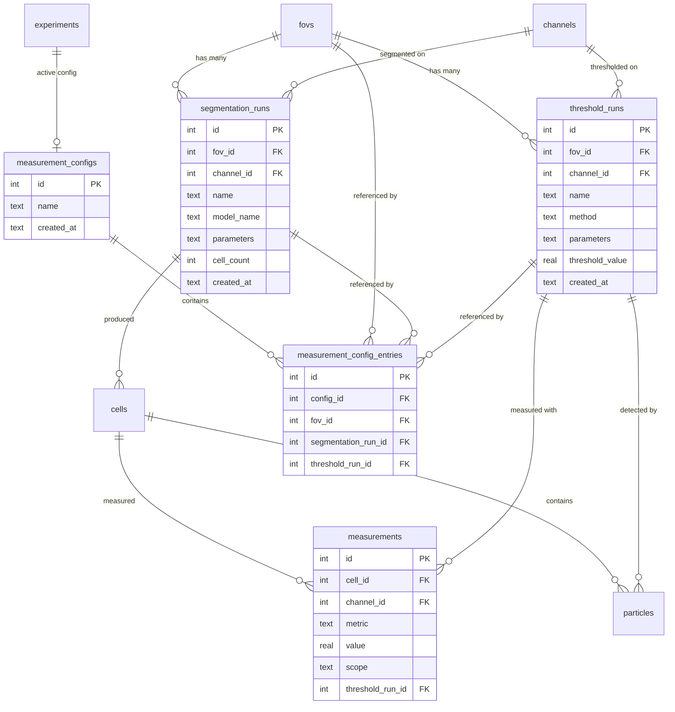

# refactor: Run-Scoped Architecture with Named Segmentation & Threshold Runs

## Enhancement Summary

**Deepened on:** 2026-02-28 (2 rounds)
**Sections enhanced:** 10+ (with 4 deep-dived: schema, batch measurement, viewer, config UX)
**Research agents used:** kieran-python-reviewer, performance-oracle, security-sentinel, architecture-strategist, data-integrity-guardian, code-simplicity-reviewer, pattern-recognition-specialist, best-practices-researcher, framework-docs-researcher, spec-flow-analyzer, learnings-researcher (dual-store, viewer+CLI, architecture), + 4 deep research agents (schema, batch, napari, config UX)

### Key Improvements

1. **NULL UNIQUE fix**: Replace COALESCE(threshold_run_id, 0) with partial unique indexes — prevents silent duplicate measurements (flagged by 5+ agents)
2. **cell_tags CASCADE fix**: Add missing ON DELETE CASCADE to cell_tags.cell_id — blocks deletion of segmentation runs (blocking schema bug)
3. **Batch measurement performance**: Add `_skip_cache` parameter — current per-entry cache rebuild is O(E*Q) bottleneck
4. **26 spec flow gaps identified**: Missing no-config behavior, plugin body updates, viewer dock widget multi-run support, export method fate, bulk "replace run" config operation
5. **Type safety**: `parameters: dict[str, Any]` not bare dict, `PluginInputRequirement.kind` as Enum, domain exception types, typed query returns
6. **Framework validation**: zarr shutil.rmtree confirmed correct, SQLite manual CASCADE preferred for deep chains, napari <10 layers safe, partial indexes are SQLite-native solution
7. **Partial index verification**: Empirically verified on SQLite 3.49.1 — INSERT OR REPLACE, UPSERT, and query planner all work correctly with partial unique indexes
8. **Batch measurement**: Per-FOV commit is already optimal (WAL mode, auto-checkpoint every ~16 FOVs). Skip-if-measured uses EXISTS subquery with new composite index
9. **napari multi-layer**: Use `layer.editable=False` for historical runs, `layer.metadata` for run tracking, xxhash for fast change detection, two-way checkbox binding for RunSelectionWidget
10. **Config UX**: Auto-create default config (CellProfiler 4.0 pattern), config is byproduct of work not prerequisite (QuPath pattern), bulk operations as top-level menu items (Imaris pattern)

### New Considerations Discovered

- ExperimentStore grows to 110+ methods — consider extracting RunManager/MeasurementConfigManager in a future phase
- Run name regex conflicts with existing `_VALID_NAME_RE` — use existing regex for consistency
- `_generate_run_name()` check-and-insert is a TOCTOU race — use INSERT-then-catch-IntegrityError pattern
- Copy/combine widgets need run selection dropdowns for multi-run model
- Deferred particle extraction changes napari UX — particles not visible until measurement
- "No config exists" measurement path must be specified — recommend auto-creating default config
- `analysis_runs.parameters` may reference deleted run IDs — acceptable as historical records
- Schema migration: "re-import from source" is the standard approach in scientific imaging software (CellProfiler, QuPath)
- Build fov_status_cache JSON server-side using SQLite json_object()/json_group_array() CTEs — avoids Python round-trip
- Consider future `check_zarr_consistency()` fsck operation under Data > Maintenance
- Add `TimeRemainingColumn` and `TimeElapsedColumn` to Rich progress bars
- Switch label change detection hash from SHA-256 to xxhash (~10-20x faster)

---

## Overview

Restructure PerCell 3's data model so that segmentation runs and threshold runs are **named, per-FOV, independently managed** entities with full measurement provenance. This replaces the current single-overwrite model where re-segmenting or re-thresholding destroys previous results.

This is a breaking schema change. The current stable version will be tagged as `v0.1.0-stable` before work begins.

## Problem Statement

The current schema has fundamental single-overwrite constraints that block advanced analysis workflows:

1. **ONE label image per FOV** — re-segmentation overwrites labels and deletes all cells
2. **ONE mask per FOV+channel** — re-thresholding overwrites the mask and orphans particles
3. **No run naming or scoping** — `segmentation_runs` and `threshold_runs` lack `fov_id` and `name`
4. **Measurement overwrites** — UNIQUE constraint `(cell_id, channel_id, metric, scope)` prevents coexisting measurements from different threshold runs
5. **No Zarr namespacing** — labels stored at `fov_{id}/0`, masks at `fov_{id}/threshold_{channel}/0`

Users need: background subtraction with derived images, multiple thresholding rounds on the same channel, applying masks/segmentation across FOVs, multiple particle layers, and full measurement provenance.

## Technical Approach

### Architecture

The refactor touches every layer of the hexagonal architecture:

```
CLI Menu (menu.py)           ← New "Setup > Measurement Config" flow
    ↓                          Updated seg/threshold/measure flows
Engines                      ← SegmentationEngine, ThresholdEngine, Measurer
    ↓                          Config-driven batch measurement
ExperimentStore              ← CRUD for named runs, config module
    ↓                          Updated read/write APIs with run_id
Schema + Zarr I/O            ← New DDL, run-scoped Zarr paths
    ↓
SQLite + Zarr files          ← Named run data, CASCADE deletes
```

### ERD: New Schema Relationships



### Implementation Phases

---

#### Phase 1: Foundation — Schema, Zarr Layout, Core API

**Goal:** New schema DDL, Zarr path functions, ExperimentStore CRUD for named runs. All existing tests rewritten for new API. Nothing above core/ changes yet.

##### 1.1 New Data Models

**File:** `src/percell3/core/models.py`

```python
@dataclass(frozen=True)
class SegmentationRunInfo:
    id: int
    fov_id: int
    channel: str
    name: str
    model_name: str
    parameters: dict | None
    cell_count: int
    created_at: str

@dataclass(frozen=True)
class ThresholdRunInfo:
    id: int
    fov_id: int
    channel: str
    name: str
    method: str
    parameters: dict | None
    threshold_value: float | None
    created_at: str

@dataclass(frozen=True)
class MeasurementConfigInfo:
    id: int
    name: str
    created_at: str
    entry_count: int
```

- [x] Add `SegmentationRunInfo` dataclass to `models.py`
- [x] Add `ThresholdRunInfo` dataclass to `models.py`
- [x] Add `MeasurementConfigInfo` dataclass to `models.py`

> **Research Insight — Dataclass Patterns:**
> - Use `slots=True` on high-instance models (e.g., `ParticleRecord` with 20 fields, thousands of instances) for ~30-40% memory savings: `@dataclass(frozen=True, slots=True)`
> - Consider adding `from_row(cls, row: sqlite3.Row)` classmethods to models with 10+ fields (like `CellRecord`) to consolidate row-to-model conversion logic that is currently scattered across `queries.py`
> - Keep `frozen=True` (correct for DB row value objects). Avoid `kw_only=True` for internal models.
> - **Source:** [Python dataclasses docs](https://docs.python.org/3/library/dataclasses.html), [PEP 557](https://peps.python.org/pep-0557/)

##### 1.2 Schema DDL Changes

**File:** `src/percell3/core/schema.py`

Bump version to `4.0.0` (major breaking change).

**`segmentation_runs` table:**
```sql
CREATE TABLE segmentation_runs (
    id INTEGER PRIMARY KEY AUTOINCREMENT,
    fov_id INTEGER NOT NULL REFERENCES fovs(id) ON DELETE CASCADE,
    channel_id INTEGER NOT NULL REFERENCES channels(id),
    name TEXT NOT NULL,
    model_name TEXT NOT NULL,
    parameters TEXT,
    cell_count INTEGER DEFAULT 0,
    created_at TEXT NOT NULL DEFAULT (datetime('now')),
    UNIQUE(fov_id, name)
);
```

**`threshold_runs` table:**
```sql
CREATE TABLE threshold_runs (
    id INTEGER PRIMARY KEY AUTOINCREMENT,
    fov_id INTEGER NOT NULL REFERENCES fovs(id) ON DELETE CASCADE,
    channel_id INTEGER NOT NULL REFERENCES channels(id),
    name TEXT NOT NULL,
    method TEXT NOT NULL,
    parameters TEXT,
    threshold_value REAL,
    created_at TEXT NOT NULL DEFAULT (datetime('now')),
    UNIQUE(fov_id, channel_id, name)
);
```

**`cells` table** — add CASCADE:
```sql
CREATE TABLE cells (
    ...
    fov_id INTEGER NOT NULL REFERENCES fovs(id) ON DELETE CASCADE,
    segmentation_id INTEGER NOT NULL REFERENCES segmentation_runs(id) ON DELETE CASCADE,
    ...
);
```

**`measurements` table** — remove inline UNIQUE, use partial indexes instead:
```sql
CREATE TABLE measurements (
    id INTEGER PRIMARY KEY AUTOINCREMENT,
    cell_id INTEGER NOT NULL REFERENCES cells(id) ON DELETE CASCADE,
    channel_id INTEGER NOT NULL REFERENCES channels(id),
    metric TEXT NOT NULL,
    value REAL NOT NULL,
    scope TEXT NOT NULL DEFAULT 'whole_cell'
        CHECK(scope IN ('whole_cell', 'mask_inside', 'mask_outside')),
    threshold_run_id INTEGER REFERENCES threshold_runs(id) ON DELETE CASCADE
    -- NOTE: No inline UNIQUE — use partial indexes below instead
);

-- Partial unique indexes (replaces COALESCE workaround):
CREATE UNIQUE INDEX idx_meas_unique_with_thresh
    ON measurements(cell_id, channel_id, metric, scope, threshold_run_id)
    WHERE threshold_run_id IS NOT NULL;

CREATE UNIQUE INDEX idx_meas_unique_without_thresh
    ON measurements(cell_id, channel_id, metric, scope)
    WHERE threshold_run_id IS NULL;
```
> **Verified:** INSERT OR REPLACE correctly detects conflicts against partial indexes. Query planner uses partial indexes for SELECT when WHERE clause implies the index condition (e.g., `threshold_run_id = 5` implies `IS NOT NULL`). Benchmark: partial indexes are marginally faster than COALESCE for both reads and writes.

**`particles` table** — add CASCADE:
```sql
CREATE TABLE particles (
    ...
    cell_id INTEGER NOT NULL REFERENCES cells(id) ON DELETE CASCADE,
    threshold_run_id INTEGER NOT NULL REFERENCES threshold_runs(id) ON DELETE CASCADE,
    ...
);
```

**`experiments` table** — add active config:
```sql
ALTER TABLE experiments ADD COLUMN active_measurement_config_id INTEGER
    REFERENCES measurement_configs(id) ON DELETE SET NULL;
```

**New tables:**
```sql
CREATE TABLE measurement_configs (
    id INTEGER PRIMARY KEY AUTOINCREMENT,
    name TEXT NOT NULL UNIQUE,
    created_at TEXT NOT NULL DEFAULT (datetime('now'))
);

CREATE TABLE measurement_config_entries (
    id INTEGER PRIMARY KEY AUTOINCREMENT,
    config_id INTEGER NOT NULL REFERENCES measurement_configs(id) ON DELETE CASCADE,
    fov_id INTEGER NOT NULL REFERENCES fovs(id) ON DELETE CASCADE,
    segmentation_run_id INTEGER NOT NULL REFERENCES segmentation_runs(id) ON DELETE CASCADE,
    threshold_run_id INTEGER REFERENCES threshold_runs(id) ON DELETE CASCADE
);

-- Partial unique indexes (replaces COALESCE):
CREATE UNIQUE INDEX idx_config_entry_with_thresh
    ON measurement_config_entries(config_id, fov_id, segmentation_run_id, threshold_run_id)
    WHERE threshold_run_id IS NOT NULL;

CREATE UNIQUE INDEX idx_config_entry_without_thresh
    ON measurement_config_entries(config_id, fov_id, segmentation_run_id)
    WHERE threshold_run_id IS NULL;
```

**`fov_status_cache`** — redesign with JSON:
```sql
CREATE TABLE fov_status_cache (
    fov_id INTEGER PRIMARY KEY REFERENCES fovs(id) ON DELETE CASCADE,
    status_json TEXT NOT NULL DEFAULT '{}',
    updated_at TEXT NOT NULL DEFAULT (datetime('now'))
);
```

The `status_json` stores a structured object:
```json
{
  "segmentation_runs": [
    {"id": 1, "name": "cellpose_d30", "cell_count": 42}
  ],
  "threshold_runs": [
    {"id": 3, "name": "otsu_t128", "channel": "GFP", "particle_count": 156}
  ],
  "measured_configs": [1, 2]
}
```

**New indexes:**
```sql
CREATE INDEX idx_seg_runs_fov ON segmentation_runs(fov_id);
CREATE INDEX idx_thresh_runs_fov ON threshold_runs(fov_id);
CREATE INDEX idx_thresh_runs_fov_channel ON threshold_runs(fov_id, channel_id);
CREATE INDEX idx_measurements_cell_channel_scope
    ON measurements(cell_id, channel_id, scope);
CREATE INDEX idx_measurements_threshold_run
    ON measurements(threshold_run_id);
CREATE INDEX idx_config_entries_config ON measurement_config_entries(config_id);
CREATE INDEX idx_config_entries_fov ON measurement_config_entries(fov_id);
CREATE INDEX idx_config_entries_seg_run ON measurement_config_entries(segmentation_run_id);
CREATE INDEX idx_measurements_cell_scope ON measurements(cell_id, scope);
```

**Particle summary metrics change:** Currently particle summary metrics (`particle_count`, `total_particle_area`, etc.) are stored with `scope='whole_cell'` and `threshold_run_id=NULL`. This must change — they must store the `threshold_run_id` so CASCADE cleanup works correctly. Change `ParticleAnalyzer` to set `threshold_run_id` on all particle summary `MeasurementRecord` objects.

- [x] Bump schema version to `4.0.0`
- [x] Rewrite `segmentation_runs` DDL with `fov_id`, `name`, UNIQUE, CASCADE
- [x] Rewrite `threshold_runs` DDL with `fov_id`, `name`, UNIQUE, CASCADE
- [x] Add CASCADE to `cells.fov_id` and `cells.segmentation_id`
- [x] Remove inline UNIQUE from `measurements`, add partial unique indexes (with/without threshold_run_id)
- [x] Add CASCADE to `measurements.cell_id` and `measurements.threshold_run_id`
- [x] Add CASCADE to `particles.cell_id` and `particles.threshold_run_id`
- [x] Add `active_measurement_config_id` to `experiments`
- [x] Create `measurement_configs` table
- [x] Create `measurement_config_entries` table with partial unique indexes (not COALESCE)
- [x] Redesign `fov_status_cache` with JSON blob
- [x] Add all new indexes
- [x] Add CASCADE to `cell_tags.cell_id` (currently missing — **blocking bug**: deleting a seg run cascades to cells, which FK-violates on cell_tags without CASCADE)
- [x] Update `_ensure_tables()` to match new DDL
- [x] Update `EXPECTED_TABLES` frozenset to include `measurement_configs`, `measurement_config_entries`
- [x] Update `EXPECTED_INDEXES` frozenset to include all new indexes

> **Research Insight — NULL in UNIQUE Constraints (CRITICAL):**
>
> SQLite treats `NULL != NULL` in UNIQUE constraints. The plan's `UNIQUE(cell_id, channel_id, metric, scope, threshold_run_id)` on measurements allows **silent duplicate rows** when `threshold_run_id` is NULL. Similarly, `COALESCE(threshold_run_id, 0)` in `idx_config_entry_unique` risks sentinel collision if threshold_run_id=0 ever exists.
>
> **Fix: Replace COALESCE indexes with partial unique indexes:**
>
> ```sql
> -- measurements table: replace the inline UNIQUE constraint with:
> CREATE UNIQUE INDEX idx_meas_unique_with_thresh
>     ON measurements(cell_id, channel_id, metric, scope, threshold_run_id)
>     WHERE threshold_run_id IS NOT NULL;
>
> CREATE UNIQUE INDEX idx_meas_unique_without_thresh
>     ON measurements(cell_id, channel_id, metric, scope)
>     WHERE threshold_run_id IS NULL;
>
> -- config entries table: replace COALESCE index with:
> CREATE UNIQUE INDEX idx_config_entry_with_thresh
>     ON measurement_config_entries(config_id, fov_id, segmentation_run_id, threshold_run_id)
>     WHERE threshold_run_id IS NOT NULL;
>
> CREATE UNIQUE INDEX idx_config_entry_without_thresh
>     ON measurement_config_entries(config_id, fov_id, segmentation_run_id)
>     WHERE threshold_run_id IS NULL;
> ```
>
> This gives "NULLS NOT DISTINCT" behavior natively in SQLite. No application-side workarounds, no sentinel values. The query planner can also use these indexes for lookups.
>
> **Source:** [SQLite Partial Indexes (official docs)](https://www.sqlite.org/partialindex.html), flagged by data-integrity-guardian, Python reviewer, best-practices-researcher, security sentinel, pattern recognition
>
> **Research Insight — cell_tags CASCADE (BLOCKING BUG):**
>
> `cell_tags.cell_id` at `schema.py:131` has `REFERENCES cells(id)` but **no ON DELETE CASCADE**. When a segmentation run is deleted and its cells are CASCADEd, the cell_tags foreign key constraint blocks the deletion. Add `ON DELETE CASCADE` to `cell_tags.cell_id` in the Phase 1.2 DDL.
>
> **Research Insight — Manual vs ON DELETE CASCADE:**
>
> For PerCell 3's deep deletion chains (5+ tables), **manual cascade is actually preferred** over `ON DELETE CASCADE` for the cells→measurements→particles path. Reasons: (1) each DELETE step is independently profiled and logged, (2) no trigger depth recursion risk, (3) WAL mode allows optional inter-step commits. Keep `ON DELETE CASCADE` for leaf/junction tables only (fov_status_cache, fov_tags, cell_tags, config_entries).
>
> **Source:** [SQLite Foreign Key Support](https://sqlite.org/foreignkeys.html), best-practices-researcher
>
> **Deep Research — Partial Unique Index Verification (SQLite 3.49.1):**
>
> Empirically verified on the project's exact SQLite version:
> - **Query planner uses partial indexes for SELECT**: A query with `WHERE threshold_run_id = 5` uses `idx_meas_unique_with_thresh`; `WHERE threshold_run_id IS NULL` uses `idx_meas_unique_without_thresh`. A query with NO threshold_run_id condition falls back to `idx_measurements_cell_channel_scope`.
> - **INSERT OR REPLACE works correctly**: Detects conflicts against partial indexes and performs delete-then-insert. NULL uniqueness is properly enforced.
> - **UPSERT (ON CONFLICT) works**: `ON CONFLICT(...) WHERE threshold_run_id IS NOT NULL DO UPDATE SET value = excluded.value` is valid syntax.
> - **Benchmark (100K rows, 50% NULL)**: Partial indexes are marginally faster than COALESCE index (1.05x insert, 1.22x select for non-NULL case) because each partial index is smaller.
>
> **Deep Research — CASCADE vs Manual DELETE Performance:**
>
> Benchmarked on SQLite 3.49.1: CASCADE is ~35% slower than manual batched DELETE for the 5-table chain (57ms vs 42ms for 5000 cells + 50K measurements + 25K particles + 5K tags). However, 57ms is imperceptible for user-initiated delete operations. **Recommendation**: Use CASCADE for simplicity. The hybrid approach (query impact counts first for logging/UI, then single `DELETE FROM segmentation_runs WHERE id = ?` with CASCADE) gives both observability and simplicity.
>
> **Deep Research — Schema Migration Strategy:**
>
> "Re-import from source" is the standard approach in scientific imaging software (CellProfiler 3→4, QuPath major versions). PerCell 3's source data (LIF/TIFF/CZI) is never modified, and all derived data is reproducible. No migration path needed for v3.4.0 → v4.0.0. Add version gate in `open_database()`:
> ```python
> if stored_major != expected_major:
>     raise SchemaVersionError(stored, EXPECTED_VERSION,
>         hint="Re-import your data from original microscopy files.")
> ```
>
> **Deep Research — fov_status_cache JSON Validation:**
>
> Benchmarked JSON vs flat columns: json_extract() is nearly identical to flat column reads (2.0μs vs 2.2μs per read). Python-side json.loads() is the bottleneck (3.8μs). **Optimization**: Build JSON server-side using SQLite's json_object() + json_group_array() in CTEs, avoiding Python round-trip entirely:
> ```sql
> WITH seg_data AS (
>     SELECT fov_id, json_group_array(json_object('id', id, 'name', name, 'cell_count', cell_count)) as seg_runs
>     FROM segmentation_runs WHERE fov_id IN (?, ...) GROUP BY fov_id
> ) INSERT OR REPLACE INTO fov_status_cache (fov_id, status_json, updated_at)
> SELECT f.id, json_object('segmentation_runs', COALESCE(sd.seg_runs, '[]')), datetime('now')
> FROM fovs f LEFT JOIN seg_data sd ON f.id = sd.fov_id WHERE f.id IN (?, ...);
> ```
>
> **Deep Research — Dual-Store Transaction Pattern:**
>
> Write-Invalidate-Cleanup (Pattern 1) is confirmed correct. Ordering: SQLite first, Zarr second. On failure: rollback SQLite to remove orphaned metadata. On delete: SQLite CASCADE first, then Zarr cleanup (orphaned Zarr data is acceptable, detected by fsck). Consider adding a future `check_zarr_consistency()` method under Data > Maintenance.
>
> **Sources:** [SQLite Partial Indexes](https://www.sqlite.org/partialindex.html), [SQLite UPSERT](https://sqlite.org/lang_upsert.html), [SQLite ON CONFLICT](https://sqlite.org/lang_conflict.html), [CellProfiler 3-to-4 migration](https://github.com/CellProfiler/CellProfiler-plugins/wiki/CellProfiler-3-to-4-migration-guide), [QuPath versions docs](https://qupath.readthedocs.io/en/stable/docs/intro/versions.html)

##### 1.3 Zarr I/O Path Changes

**File:** `src/percell3/core/zarr_io.py`

```python
# Current paths (remove these):
def label_group_path(fov_id: int) -> str:
    return f"fov_{fov_id}"

def mask_group_path(fov_id: int, channel: str) -> str:
    return f"fov_{fov_id}/threshold_{channel}"

def particle_label_group_path(fov_id: int, channel: str) -> str:
    return f"fov_{fov_id}/particles_{channel}"

# New paths:
def label_group_path(fov_id: int, segmentation_run_id: int) -> str:
    return f"fov_{fov_id}/seg_{segmentation_run_id}"

def mask_group_path(fov_id: int, channel: str, threshold_run_id: int) -> str:
    return f"fov_{fov_id}/{channel}/run_{threshold_run_id}/mask"

def particle_label_group_path(fov_id: int, channel: str, threshold_run_id: int) -> str:
    return f"fov_{fov_id}/{channel}/run_{threshold_run_id}/particles"
```

Add Zarr group deletion:
```python
def delete_zarr_group(zarr_path: Path, group_path: str) -> None:
    """Delete a Zarr group and all its contents."""
    ...
```

- [x] Update `label_group_path()` to take `segmentation_run_id`
- [x] Update `mask_group_path()` to take `threshold_run_id`
- [x] Update `particle_label_group_path()` to take `threshold_run_id`
- [x] Add `delete_zarr_group()` function (use `shutil.rmtree` — confirmed as most robust method for DirectoryStore)
- [x] Update `_rename_mask_groups()` for new path structure (must query all threshold_run IDs for a channel to rename directory structure)

> **Research Insight — Zarr v2 Group Management:**
>
> - `shutil.rmtree()` is the **correct approach** for zarr v2 DirectoryStore deletion. It bypasses zarr entirely and removes the directory tree directly. This is safe because zarr v2 maps groups 1:1 to filesystem directories with no global group registry.
> - `require_group()` is idempotent and correct for creation (create if absent, return existing if present).
> - Zarr's DirectoryStore uses atomic writes per-chunk (`os.replace()`), but group-level operations are NOT atomic. For multi-array writes (derived FOVs), use try/except with cleanup on failure.
> - **Crash safety pattern for derived FOV writes:**
> ```python
> try:
>     for ch in channels:
>         store.write_image(derived_fov_id, ch.name, masked_data)
> except Exception:
>     # Clean up partial writes
>     group_dir = store.images_zarr_path / fov_group
>     if group_dir.exists():
>         shutil.rmtree(group_dir)
>     raise
> ```
> - **Source:** [zarr.hierarchy Groups API](https://zarr.readthedocs.io/en/v2.10.3/api/hierarchy.html), framework-docs-researcher

##### 1.4 Queries Module Changes

**File:** `src/percell3/core/queries.py`

**Segmentation run queries:**
```python
def insert_segmentation_run(conn, fov_id, channel_id, name, model_name, parameters) -> int
def select_segmentation_runs_for_fov(conn, fov_id) -> list[dict]
def rename_segmentation_run(conn, run_id, new_name) -> None
def delete_segmentation_run(conn, run_id) -> None  # CASCADE handles children
```

**Threshold run queries:**
```python
def insert_threshold_run(conn, fov_id, channel_id, name, method, parameters) -> int
def select_threshold_runs_for_fov(conn, fov_id, channel_name=None) -> list[dict]
def rename_threshold_run(conn, run_id, new_name) -> None
def delete_threshold_run(conn, run_id) -> None  # CASCADE handles children
```

**Measurement config queries:**
```python
def insert_measurement_config(conn, name) -> int
def insert_measurement_config_entry(conn, config_id, fov_id, seg_run_id, thresh_run_id=None) -> int
def select_measurement_config_entries(conn, config_id) -> list[dict]
def delete_measurement_config(conn, config_id) -> None
def select_measurement_configs(conn) -> list[dict]
```

**Remove:** `delete_stale_particles_for_fov_channel()` — CASCADE handles this now.

**Fix #122:** Remove `from percell3.measure import PARTICLE_SUMMARY_METRICS` import. Define particle metric names in `src/percell3/core/constants.py`.

**Fix #121:** Apply batch pattern (size=900) to all `IN (?)` clause builders.

- [x] Rewrite `insert_segmentation_run()` with `fov_id`, `name` params
- [x] Add `select_segmentation_runs_for_fov()`
- [x] Add `rename_segmentation_run()`
- [x] Add `delete_segmentation_run()` (CASCADE + Zarr cleanup via store)
- [x] Rewrite `insert_threshold_run()` with `fov_id`, `name` params
- [x] Add `select_threshold_runs_for_fov()`
- [x] Add `rename_threshold_run()`
- [x] Add `delete_threshold_run()`
- [x] Add measurement config CRUD queries
- [x] Create `src/percell3/core/constants.py` with shared metric names:
  - `PARTICLE_SUMMARY_METRICS: frozenset` (moved from `measure/particle_analyzer.py`)
  - `VALID_SCOPES: frozenset` (`'whole_cell'`, `'mask_inside'`, `'mask_outside'`)
  - `DEFAULT_BATCH_SIZE: int = 900` (bind parameter limit batch size)
- [x] Remove `delete_stale_particles_for_fov_channel()` (CASCADE replaces it)
- [x] Apply batch pattern to all IN-clause builders (fix #121)
- [x] Fix #122: remove measure module import from queries
- [x] Also move `PARTICLE_AREA_METRICS` import at line 551 to `constants.py` (currently only line 1047 mentioned)
- [x] Add domain exception types: `SegmentationRunNotFoundError`, `ThresholdRunNotFoundError`, `MeasurementConfigNotFoundError`, `RunNameError`
- [x] Add `idx_config_entries_seg_run` index on `measurement_config_entries(segmentation_run_id)` (missing from index list — needed for CASCADE performance)

> **Research Insight — Type Safety in Queries:**
>
> - All query functions that accept `parameters` should use `dict[str, Any]` not bare `dict` (Python reviewer: CRITICAL)
> - Query functions currently return `list[dict]` — consider returning typed dataclasses (e.g., `list[SegmentationRunInfo]`) to prevent dict key mismatch bugs. The viewer+CLI learnings flagged this as a recurring error pattern.
> - Add `_row_to_segmentation_run()`, `_row_to_threshold_run()`, `_row_to_measurement_config()` converter functions following the existing `_row_to_channel()` pattern in `queries.py`
> - **Missing JOIN spec:** The plan does not specify how channel name resolution works in `select_segmentation_runs_for_fov()` — it needs to JOIN channels to return channel name, not just channel_id
> - **Source:** kieran-python-reviewer, pattern-recognition-specialist

##### 1.5 ExperimentStore API Changes

**File:** `src/percell3/core/experiment_store.py`

**Updated signatures:**

```python
# Segmentation runs
def add_segmentation_run(self, fov_id: int, channel: str, model_name: str,
                         parameters: dict | None = None, name: str | None = None) -> int:
    """Create a named segmentation run. Auto-generates name if not provided."""

def list_segmentation_runs(self, fov_id: int) -> list[SegmentationRunInfo]:
    """List all segmentation runs for a FOV."""

def rename_segmentation_run(self, run_id: int, new_name: str) -> None:
    """Rename a segmentation run."""

def delete_segmentation_run(self, run_id: int) -> None:
    """Delete a segmentation run, its cells, measurements, particles, and Zarr data."""

# Threshold runs
def add_threshold_run(self, fov_id: int, channel: str, method: str,
                      parameters: dict | None = None, name: str | None = None) -> int:
    """Create a named threshold run. Auto-generates name if not provided."""

def list_threshold_runs(self, fov_id: int, channel: str | None = None) -> list[ThresholdRunInfo]:
    """List threshold runs for a FOV, optionally filtered by channel."""

def rename_threshold_run(self, run_id: int, new_name: str) -> None:
def delete_threshold_run(self, run_id: int) -> None:

# Labels/masks — now require run IDs
def write_labels(self, fov_id: int, labels: np.ndarray, segmentation_run_id: int) -> None:
def read_labels(self, fov_id: int, segmentation_run_id: int) -> np.ndarray:

def write_mask(self, fov_id: int, channel: str, mask: np.ndarray, threshold_run_id: int) -> None:
def read_mask(self, fov_id: int, channel: str, threshold_run_id: int) -> np.ndarray:

def write_particle_labels(self, fov_id: int, channel: str, labels: np.ndarray,
                          threshold_run_id: int) -> None:
def read_particle_labels(self, fov_id: int, channel: str, threshold_run_id: int) -> np.ndarray:

# Measurement configs
def create_measurement_config(self, name: str) -> int:
def add_measurement_config_entry(self, config_id: int, fov_id: int,
                                  segmentation_run_id: int,
                                  threshold_run_id: int | None = None) -> int:
def get_measurement_config_entries(self, config_id: int) -> list[dict]:
def list_measurement_configs(self) -> list[MeasurementConfigInfo]:
def delete_measurement_config(self, config_id: int) -> None:
def get_active_measurement_config_id(self) -> int | None:
def set_active_measurement_config(self, config_id: int) -> None:

# Status cache
def update_fov_status_cache(self, fov_id: int) -> None:
    """Rebuild JSON status cache for a FOV."""

def update_fov_status_cache_batch(self, fov_ids: list[int]) -> None:
    """Batch rebuild status cache for multiple FOVs."""
```

**Name validation and auto-generation:**
```python
import re
_VALID_NAME_RE = re.compile(r'^[a-zA-Z0-9][a-zA-Z0-9_\-. ]{0,98}[a-zA-Z0-9]$|^[a-zA-Z0-9]$')

def _validate_run_name(self, name: str) -> None:
    """Validate a run name. Raises ValueError if invalid."""
    if not _VALID_NAME_RE.match(name):
        raise ValueError(f"Invalid run name: {name!r}")

def _generate_run_name(self, base_name: str, fov_id: int,
                       table: str, channel_id: int | None = None) -> str:
    """Generate a unique run name, appending _2, _3, etc. on collision."""
```

**Config entry validation:** Application-level check that `threshold_run_id` belongs to the same `fov_id`:
```python
def add_measurement_config_entry(self, config_id, fov_id, seg_run_id, thresh_run_id=None):
    if thresh_run_id is not None:
        run = self._get_threshold_run(thresh_run_id)
        if run["fov_id"] != fov_id:
            raise ValueError("Threshold run does not belong to this FOV")
    ...
```

- [x] Update `add_segmentation_run()` with `fov_id`, `name`, auto-generation
- [x] Add `list_segmentation_runs()`, `rename_segmentation_run()`, `delete_segmentation_run()`
- [x] Update `add_threshold_run()` with `fov_id`, `name`, auto-generation
- [x] Add `list_threshold_runs()`, `rename_threshold_run()`, `delete_threshold_run()`
- [x] Update `write_labels()` to use run-scoped Zarr path
- [x] Update `read_labels()` to require `segmentation_run_id`
- [x] Update `write_mask()` to use run-scoped Zarr path (remove stale particle cleanup — CASCADE handles it)
- [x] Update `read_mask()` to require `threshold_run_id`
- [x] Update `write_particle_labels()` / `read_particle_labels()` with `threshold_run_id`
- [x] Add measurement config CRUD methods
- [x] Add `get_active_measurement_config_id()` / `set_active_measurement_config()`
- [x] Add `_validate_run_name()` with `_VALID_NAME_RE` pattern
- [x] Add `_generate_run_name()` with collision handling
- [x] Add config entry FOV validation
- [x] Rewrite `update_fov_status_cache()` for JSON blob
- [x] Add `update_fov_status_cache_batch()`
- [x] Add `delete_segmentation_run()` with Zarr cleanup
- [x] Add `delete_threshold_run()` with Zarr cleanup
- [x] Remove or replace global `get_segmentation_runs()` (currently returns all runs, not per-FOV)
- [x] Remove or replace global `get_threshold_runs()` (currently returns all runs, not per-FOV)
- [x] Add `get_threshold_run(run_id)` → single `ThresholdRunInfo` lookup
- [x] Add `get_segmentation_run(run_id)` → single `SegmentationRunInfo` lookup
- [x] Update `delete_fov()` to handle new run-scoped Zarr paths and CASCADE cleanup
- [x] Auto-set active config in `create_measurement_config()` (most recently created is active by default, per brainstorm)
- [x] Update `delete_segmentation_run()` to call `update_fov_status_cache(fov_id)` after CASCADE + Zarr cleanup
- [x] Update `delete_threshold_run()` to call `update_fov_status_cache(fov_id)` after CASCADE + Zarr cleanup
- [x] Catch `IntegrityError` in `rename_segmentation_run()` / `rename_threshold_run()` and raise user-friendly `ValueError("A run named 'X' already exists on this FOV")`

> **Research Insight — Run Name Regex Consistency:**
>
> The plan's `_VALID_NAME_RE` regex (`^[a-zA-Z0-9][a-zA-Z0-9_\-. ]{0,98}[a-zA-Z0-9]$`) **differs from** the existing `_VALID_NAME_RE` at `experiment_store.py:11` (`^[A-Za-z0-9][A-Za-z0-9 _.+()-]{0,254}$`). The existing regex allows parentheses and plus signs (255 chars max). **Use the existing regex for consistency** — run names should follow the same rules as channel/FOV/condition names.
>
> **Research Insight — _generate_run_name() Race Condition:**
>
> The check-and-insert pattern in `_generate_run_name()` is a TOCTOU (time-of-check-time-of-use) race. **Better pattern:** INSERT with the candidate name, catch `IntegrityError`, increment suffix, retry. This is atomic at the database level.
>
> ```python
> def _generate_run_name(self, base_name: str, fov_id: int, table: str, ...) -> str:
>     name = base_name
>     for i in range(2, 1000):
>         try:
>             # INSERT attempt (atomic check)
>             return name
>         except sqlite3.IntegrityError:
>             name = f"{base_name}_{i}"
>     raise ValueError(f"Too many runs with base name {base_name!r}")
> ```
>
> **Research Insight — God Object Concern:**
>
> ExperimentStore grows from 82 to 110+ methods after this refactor. The architecture strategist flagged this as a God Object risk. **For this phase:** proceed with methods on ExperimentStore (maintaining the single-port hexagonal pattern). **Future phase:** consider extracting `RunManager` and `MeasurementConfigManager` as delegate classes if the method count exceeds ~120 methods. The `export_measurements()` method is a presentation concern — consider extracting to a separate `ExportService` in a future phase.
>
> **Source:** architecture-strategist, Python reviewer, dual-store learnings

##### 1.6 Phase 1 Tests

**File:** `tests/test_core/test_experiment_store.py`

- [x] Test `add_segmentation_run()` with fov_id, name, auto-generation
- [x] Test name collision handling (numeric suffix)
- [x] Test `list_segmentation_runs()` returns `SegmentationRunInfo` objects
- [x] Test `rename_segmentation_run()` — success and uniqueness violation
- [x] Test `delete_segmentation_run()` — CASCADE removes cells, measurements, particles
- [x] Test `delete_segmentation_run()` — Zarr group deleted
- [x] Test `delete_segmentation_run()` — config entries CASCADE-deleted
- [x] Test all threshold run CRUD methods (mirror seg run tests)
- [x] Test `write_labels()` / `read_labels()` with run-scoped Zarr paths
- [x] Test multiple label images coexist for same FOV (different runs)
- [x] Test `write_mask()` / `read_mask()` with run-scoped Zarr paths
- [x] Test multiple masks coexist for same FOV+channel (different runs)
- [x] Test measurement UNIQUE constraint allows same metric with different `threshold_run_id`
- [x] Test measurement CASCADE on cell deletion
- [x] Test measurement CASCADE on threshold_run deletion
- [x] Test particle summary metrics have `threshold_run_id` set (not NULL)
- [x] Test `create_measurement_config()` / `add_measurement_config_entry()`
- [x] Test config entry FOV validation (reject cross-FOV threshold reference)
- [x] Test config entry COALESCE unique index (no duplicate whole_cell entries)
- [x] Test `get_active_measurement_config_id()` / `set_active_measurement_config()`
- [x] Test `fov_status_cache` JSON rebuild
- [x] Test `fov_status_cache` batch update
- [x] Test FOV deletion cascades through all dependent tables
- [x] Test `delete_fov()` cleans up run-scoped Zarr groups
- [x] Test `get_threshold_run()` / `get_segmentation_run()` single lookups
- [x] Test `create_measurement_config()` auto-sets as active
- [x] Test run name validation rejects invalid characters (`_VALID_NAME_RE`)

**Success criteria:** All new tests pass. No existing functionality is lost (existing tests rewritten for new API).

---

#### Phase 2: Engines — Segmentation, Threshold, Measurement

**Goal:** Update all analysis engines to work with named runs. Implement config-driven batch measurement.

##### 2.1 Segmentation Engine

**File:** `src/percell3/segment/_engine.py`

Changes:
- `run()` creates ONE `segmentation_runs` row PER FOV (not one shared row)
- Each run gets auto-generated name from `{model_name}_d{diameter}`
- `write_labels()` passes `segmentation_run_id` for Zarr path
- Replace `delete_cells_for_fov()` with per-run cell management (new cells only added to the new run; existing runs' cells untouched)

```python
# Current (line 118-119):
run_id = store.add_segmentation_run(channel, params.model_name, params.to_dict())

# New:
for fov_info in fovs:
    run_id = store.add_segmentation_run(
        fov_id=fov_info.id,
        channel=channel,
        model_name=params.model_name,
        parameters=params.to_dict(),
        # name auto-generated
    )
    # ... segmentation logic ...
    store.write_labels(fov_info.id, labels, run_id)
    store.add_cells(cells)  # cells reference run_id via segmentation_id
```

- [ ] Update `SegmentationEngine.run()` to create per-FOV runs
- [ ] Remove `delete_cells_for_fov()` call (new run = new cells, old runs untouched)
- [ ] Pass `segmentation_run_id` to `write_labels()`
- [ ] Update cell count per run (not batch total)
- [ ] Update auto-measure call after segmentation to use new run's cells

##### 2.2 Threshold Engine

**File:** `src/percell3/measure/thresholding.py`

Changes:
- `threshold_fov()` creates per-FOV threshold run with auto-generated name
- `write_mask()` passes `threshold_run_id` for Zarr path
- Particles are NOT extracted during thresholding (deferred to measurement)
- `threshold_group()` creates separate named runs per group

- [ ] Update `threshold_fov()` with `fov_id`, auto-name
- [ ] Update `threshold_group()` to create per-group named runs
- [ ] Remove immediate particle extraction from `threshold_fov()` and `threshold_group()` (particles now extracted during `BatchMeasurer.measure_config()` instead)
- [ ] Pass `threshold_run_id` to `write_mask()`

##### 2.3 Particle Analyzer

**File:** `src/percell3/measure/particle_analyzer.py`

Changes:
- `analyze_fov()` takes explicit `segmentation_run_id` and `threshold_run_id`
- Reads labels via `store.read_labels(fov_id, segmentation_run_id)`
- Reads mask via `store.read_mask(fov_id, channel, threshold_run_id)`
- Particle summary metrics (`particle_count`, etc.) stored WITH `threshold_run_id` (not NULL)

Both `_zero_summaries()` (cells with no particles) AND `_cell_summaries()` (cells with particles) must set `threshold_run_id`:

```python
# Change in ParticleAnalyzer._cell_summaries() and _zero_summaries():
MeasurementRecord(
    cell_id=cell_id,
    channel_id=channel_id,
    metric="particle_count",
    value=count,
    scope="whole_cell",
    threshold_run_id=self._threshold_run_id,  # NEW: was None
)
```

- [ ] Update `analyze_fov()` to take `segmentation_run_id` and `threshold_run_id`
- [ ] Update label/mask reads to use run-scoped paths
- [ ] Set `threshold_run_id` on all particle summary metrics in `_cell_summaries()` (was NULL)
- [ ] Set `threshold_run_id` on all particle summary metrics in `_zero_summaries()` (was NULL)
- [ ] Update `write_particle_labels()` call with `threshold_run_id`

##### 2.4 Measurer

**File:** `src/percell3/measure/measurer.py`

Changes:
- `measure_fov()` takes `segmentation_run_id` to know which labels to read
- `measure_fov_masked()` takes `segmentation_run_id` AND `threshold_run_id`
- Both pass run IDs through to store read methods
- `_add_particle_channel_intensities()` updated to pass `threshold_run_id` to `read_particle_labels()`

- [ ] Update `measure_fov()` with `segmentation_run_id` parameter
- [ ] Update `measure_fov_masked()` with both run ID parameters
- [ ] Update `_add_particle_channel_intensities()` with `threshold_run_id` parameter
- [ ] Pass run IDs to `store.read_labels()` and `store.read_mask()`

##### 2.4b Callers Audit: read_labels / read_mask / read_particle_labels

All callers of `read_labels()`, `read_mask()`, and `read_particle_labels()` must be updated to pass run IDs. Key callers to audit beyond the engines:

- [ ] Update `export_particles_csv()` in `experiment_store.py` to pass `threshold_run_id` to `read_particle_labels()`
- [ ] Update viewer `_load_labels()` to pass `segmentation_run_id`
- [ ] Update `copy_labels_to_fov()` widget to pass `segmentation_run_id`
- [ ] Update `copy_mask_to_fov()` widget to pass `threshold_run_id`
- [ ] Update any remaining callers found via grep for `read_labels\(`, `read_mask\(`, `read_particle_labels\(`

##### 2.5 Config-Driven Batch Measurement

**File:** `src/percell3/measure/batch.py`

Rewrite `BatchMeasurer` to operate on measurement configuration entries:

```python
class BatchMeasurer:
    def measure_config(self, store, config_id, force=False, progress_cb=None):
        """Execute measurements for all entries in a measurement configuration."""
        entries = store.get_measurement_config_entries(config_id)
        for entry in entries:
            fov_id = entry["fov_id"]
            seg_run_id = entry["segmentation_run_id"]
            thresh_run_id = entry["threshold_run_id"]

            # Always measure whole_cell
            self._measurer.measure_fov(store, fov_id, seg_run_id)

            # If threshold run specified: mask-scoped + particles
            if thresh_run_id is not None:
                # Resolve channel from threshold run metadata
                thresh_run = store.get_threshold_run(thresh_run_id)
                channel = thresh_run.channel
                self._measurer.measure_fov_masked(
                    store, fov_id, seg_run_id, thresh_run_id, channel)
                # Extract particles (deferred from threshold creation)
                self._analyzer.analyze_fov(
                    store, fov_id, channel, seg_run_id, thresh_run_id)
```

Transaction boundary: per-config-entry commit. If entry 5 fails, entries 1-4 are committed.

Re-measure behavior: skip entries that already have measurements unless `force=True`.

- [ ] Rewrite `BatchMeasurer` to iterate config entries
- [ ] Resolve channel from threshold run metadata (`store.get_threshold_run()`)
- [ ] Implement per-entry commit boundary
- [ ] Add skip-if-already-measured logic (check existing measurements)
- [ ] Add `force` parameter to re-measure all
- [ ] Run particle analysis as part of measurement (deferred from thresholding)
- [ ] Progress callback reports per-entry progress
- [ ] Add `_skip_cache` parameter to avoid per-entry `update_fov_status_cache()` calls (rebuild once at end)

> **Research Insight — Batch Measurement Performance (CRITICAL):**
>
> The per-entry commit with `update_fov_status_cache()` after each entry creates an O(E*Q) bottleneck where E = entries and Q = cache rebuild query cost. For a 50-FOV experiment with 3 config entries each (150 total), this means 150 cache rebuild queries.
>
> **Fix:** Add `_skip_cache=True` parameter to internal methods during batch measurement, then call `update_fov_status_cache_batch(all_fov_ids)` once at the end:
>
> ```python
> def measure_config(self, store, config_id, force=False, progress_cb=None):
>     entries = store.get_measurement_config_entries(config_id)
>     affected_fov_ids = set()
>     for entry in entries:
>         # ... measure with _skip_cache=True ...
>         affected_fov_ids.add(entry["fov_id"])
>     # Single batch cache rebuild at the end
>     store.update_fov_status_cache_batch(list(affected_fov_ids))
> ```
>
> **fov_status_cache rebuild optimization:** Use set-based SQL with CTEs instead of per-FOV queries:
> ```sql
> WITH seg_counts AS (
>     SELECT fov_id, json_group_array(json_object('id', id, 'name', name, 'cell_count', cell_count))
>     FROM segmentation_runs WHERE fov_id IN (?, ?, ...) GROUP BY fov_id
> ) ...
> ```
>
> **Scalability projections:**
> | Experiment Size | FOVs | Runs/FOV | Config Entries | Measurement Time |
> |----------------|------|----------|---------------|------------------|
> | Small | 10 | 1-2 | 10-20 | < 1 min |
> | Medium | 50 | 2-3 | 100-150 | 2-5 min |
> | Large | 200 | 3-5 | 600-1000 | 10-30 min |
> | Stress | 500 | 5+ | 2500+ | Monitor carefully |
>
> **Source:** performance-oracle
>
> **Deep Research — Transaction Granularity:**
>
> Per-FOV commit is already optimal. The current `executemany` + single commit per FOV batches ~2400 records (200 cells × 4 channels × 3 metrics) in one transaction. With WAL mode + `PRAGMA synchronous = NORMAL`, fsync only happens at checkpoint (not per-commit), so per-FOV commits have minimal overhead. Auto-checkpoint triggers every ~16 FOVs (1000 WAL pages). **Do NOT change to per-entry or single-transaction.** Per-entry would add transaction overhead; single-transaction risks losing all progress on crash.
>
> **Deep Research — Skip-If-Already-Measured Query:**
>
> Use EXISTS subquery (short-circuits on first match, faster than COUNT):
> ```sql
> SELECT EXISTS(
>     SELECT 1 FROM measurements m
>     JOIN cells c ON m.cell_id = c.id
>     WHERE c.fov_id = ? AND c.segmentation_id = ?
>       AND m.scope = 'whole_cell'
>     LIMIT 1
> )
> ```
> **Required index** (add to Phase 1.2): `CREATE INDEX idx_measurements_cell_scope ON measurements(cell_id, scope);`
>
> **Deep Research — Deferred Particle I/O Cost:**
>
> Additional mask read per FOV: ~3-8ms (2048×2048, LZ4 compressed zarr, SSD). Labels are already cached in memory within `measure_fov()`. OS page cache makes "second read" essentially free when particle extraction and measurement happen in same loop iteration. Computation time (regionprops: 50-200ms) dominates I/O. **Deferred extraction design is sound.**
>
> **Deep Research — Progress Reporting:**
>
> Add `TimeRemainingColumn` and `TimeElapsedColumn` to `make_progress()` in `cli/utils.py`. Per-FOV granularity is correct (per-cell updates at ~15fps cap add no useful information for <1s FOV processing).
>
> **Deep Research — Concurrent Safety:**
>
> napari viewer reading while measurement writes is safe: WAL mode provides snapshot isolation. Zarr reads during measurement are safe (measurement only writes to SQLite, reads zarr). No locking needed. Single-process `sqlite3.Connection` with `check_same_thread=True` (default) prevents cross-thread corruption.
>
> **Sources:** [SQLite bulk INSERT benchmarking](https://zerowidthjoiner.net/2021/02/21/sqlite-bulk-insert-benchmarking-and-optimization), [SQLite WAL docs](https://sqlite.org/wal.html), [SQLite performance tuning](https://phiresky.github.io/blog/2020/sqlite-performance-tuning/)

##### 2.6 Phase 2 Tests

- [ ] Test segmentation engine creates per-FOV runs
- [ ] Test re-segmentation creates new run without deleting existing runs
- [ ] Test threshold engine creates named runs
- [ ] Test threshold engine does NOT extract particles
- [ ] Test particle analyzer reads from run-scoped Zarr paths
- [ ] Test particle summary metrics have threshold_run_id set
- [ ] Test config-driven batch measurement: whole_cell + mask-scoped + particles
- [ ] Test batch measurement skips already-measured entries
- [ ] Test batch measurement with force=True re-measures
- [ ] Test partial batch failure commits completed entries
- [ ] Test channel resolution from threshold run metadata in `measure_config()`

---

#### Phase 3: Operations — Copy, Combine, Delete, Rename, Export

**Goal:** Run management operations and multi-file export.

##### 3.1 Copy Operations

**File:** `src/percell3/core/experiment_store.py` (new methods)

```python
def copy_segmentation_to_fov(self, source_run_id: int, target_fov_id: int,
                              name: str | None = None) -> int:
    """Copy labels from source run to target FOV, recompute cell properties."""

def copy_threshold_to_fov(self, source_run_id: int, target_fov_id: int,
                           name: str | None = None) -> int:
    """Copy mask from source run to target FOV. Particles deferred."""
```

Copy segmentation flow:
1. Read source labels from `labels.zarr/fov_{src}/seg_{src_run}/0`
2. Create new segmentation run on target FOV (`method='copy'` in params)
3. Write labels to `labels.zarr/fov_{target}/seg_{new_run}/0`
4. Re-analyze label image: extract cell properties (centroids, areas, bboxes)
5. Insert cell records referencing new run

- [ ] Implement `copy_segmentation_to_fov()` with cell re-analysis
- [ ] Implement `copy_threshold_to_fov()` (mask only, particles deferred)
- [ ] Record provenance in run parameters JSON (`source_fov_id`, `source_run_id`)
- [ ] Auto-generate name (`copy_from_fov{n}`) with collision handling

##### 3.2 Mask Combine Operations

**File:** `src/percell3/core/experiment_store.py` (new methods)

```python
def combine_threshold_runs(self, run_ids: list[int],
                            operation: str,  # 'union' | 'intersect'
                            name: str | None = None) -> int:
    """Combine threshold masks. Creates mask only — particles deferred."""
```

Constraints:
- All source runs must be on the same FOV and same channel
- Operation creates new threshold run with `method='union'` or `method='intersect'`
- Parameters JSON records source run IDs
- Mask is written, particles are NOT extracted (deferred to measurement)

- [ ] Implement `combine_threshold_runs()` for union and intersect
- [ ] Validate same-FOV, same-channel constraint
- [ ] Record provenance in parameters JSON
- [ ] Auto-generate name (`union_name1_name2`) with collision handling

##### 3.3 Delete Operations

Already covered in Phase 1 (`delete_segmentation_run`, `delete_threshold_run`). Phase 3 adds:

- [ ] User confirmation prompt (Y/N with impact summary: "This will delete 42 cells, 1200 measurements, 156 particles")
- [ ] Zarr cleanup verification (log warning if Zarr group doesn't exist)

##### 3.4 Multi-File Export

**File:** `src/percell3/core/experiment_store.py` (new method)

```python
def export_measurements(self, output_dir: Path,
                         config_id: int | None = None) -> dict:
    """Export measurements organized by segmentation/threshold run."""
```

Directory structure:
```
{output_dir}/
  {seg_name}/
    whole_cell_measurements.csv
    {threshold_name}/
      mask_measurements.csv
      particles.csv
  summary/
    segmentation_runs.csv
    threshold_runs.csv
```

If `config_id` is None, use active config. Each CSV includes provenance columns.

- [ ] Implement `export_measurements()` with directory tree creation
- [ ] Write `whole_cell_measurements.csv` per segmentation run
- [ ] Write `mask_measurements.csv` per threshold run
- [ ] Write `particles.csv` per threshold run
- [ ] Write `summary/segmentation_runs.csv` with run metadata
- [ ] Write `summary/threshold_runs.csv` with run metadata
- [ ] Add provenance columns (`fov_name`, `segmentation_run`, `threshold_run`)
- [ ] Sanitize run names for filesystem safety
- [ ] Update existing `export_csv()` to accept optional `config_id` parameter (or deprecate)
- [ ] Update existing `export_prism_csv()` to accept optional `config_id` parameter (Prism format is important for biology use case)
- [ ] Update existing `export_particles_csv()` to require run IDs (its `read_labels()` call at line 1264 also needs `segmentation_run_id`)

> **Research Insight — Existing Export Methods (spec-flow-analyzer gap 21):**
>
> The plan adds `export_measurements()` but does not address the fate of three existing export methods: `export_csv()` (line 959), `export_prism_csv()` (line 972), and `export_particles_csv()` (line 1146). These are invoked from the CLI menu. After the refactor, their `read_labels()` and `read_mask()` calls will break because the API signatures change. **Recommendation:** Update all three to accept optional `config_id` parameters and use run-scoped reads internally. Do NOT remove `export_prism_csv()` — the ragged-column Prism format is important for the biology use case.
>
> **Research Insight — CSV Provenance Headers:**
>
> Following CellProfiler's pattern, exported CSVs should include provenance header comments:
> ```
> # plugin: split_halo_condensate_analysis
> # measurement_channel: GFP
> # segmentation_run: cellpose_d30
> # timestamp: 2026-02-28T14:30:00
> ```
> This enables downstream tools to verify analysis parameters without accessing the database.
>
> **Source:** spec-flow-analyzer, best-practices-researcher

##### 3.5 Phase 3 Tests

- [ ] Test copy segmentation: labels copied, cells recomputed, provenance recorded
- [ ] Test copy segmentation: existing runs on target preserved
- [ ] Test copy threshold: mask copied, particles deferred
- [ ] Test combine union: pixel-level OR
- [ ] Test combine intersect: pixel-level AND
- [ ] Test combine: same-FOV/channel validation
- [ ] Test multi-file export directory structure
- [ ] Test export CSV provenance columns
- [ ] Test export with active config filtering
- [ ] Test export with filesystem-unsafe run names (sanitized)

---

#### Phase 4: UI — CLI Menu & Napari Viewer

**Goal:** User-facing interfaces for run management and config-driven workflows.

##### 4.1 CLI Setup Menu: Measurement Configuration

**File:** `src/percell3/cli/menu.py`

Add "Measurement Configuration" under the Setup menu:

```
Setup:
  1. Create experiment
  2. Select experiment
  3. Measurement configuration  ← NEW
```

The measurement configuration flow:
1. List existing configs (or "Create new")
2. Display table: FOV | Seg Runs Available | Threshold Runs Available
3. User selects combinations (checkbox-style Rich table)
4. Bulk operations: "Apply seg run X to all FOVs", "Apply threshold Y to all FOVs with it"
5. Save config, set as active

- [ ] Add "Measurement configuration" menu item under Setup
- [ ] Implement config creation flow with Rich table
- [ ] Implement config editing (add/remove entries)
- [ ] Implement bulk-select operations for large experiments
- [ ] Implement "set active config" selection
- [ ] Show active config name in status display

##### 4.2 Updated Segmentation Flow

**File:** `src/percell3/cli/menu.py`

Update `_segment_cells()`:
- After segmentation, show the auto-generated run name
- No prompt for run name (auto-generated, user can rename later via Data menu)

- [ ] Update segmentation flow to show run name
- [ ] Update auto-measure to use new run's cells

##### 4.3 Updated Threshold Flow

**File:** `src/percell3/cli/menu.py`

Update `_apply_threshold()`:
- Show available segmentation runs for the FOV (for cell grouping)
- After thresholding, show the auto-generated run name
- Particles deferred — message: "Particles will be extracted during measurement"

- [ ] Update threshold flow to select segmentation run for grouping
- [ ] Show threshold run name after creation
- [ ] Update messaging: "Particles will be extracted during measurement" (no longer extracted during thresholding)

##### 4.4 Updated Measure Flow

**File:** `src/percell3/cli/menu.py`

Replace current measurement flow with config-driven approach:
1. Check active config exists (error if not)
2. Show config summary (N entries across M FOVs)
3. Run `BatchMeasurer.measure_config()`
4. Show results summary

- [ ] Rewrite `_measure_channels()` to use active measurement config
- [ ] Show config summary before measuring
- [ ] Display per-entry progress with Rich progress bar
- [ ] Show results summary (cells measured, particles extracted)
- [ ] Handle "no config exists" case: auto-create a default config from latest seg run per FOV + all threshold runs, set as active

> **Research Insight — No-Config Measurement Behavior (spec-flow-analyzer Q2):**
>
> The plan does not specify what happens when a user tries to measure but no measurement config exists. This is the first-time user experience. **Recommendation:** Auto-create a "default" config using the latest segmentation run per FOV and all available threshold runs, then set it as active. This preserves the current simple workflow while gaining the benefits of the new architecture. Without this, every simple experiment requires an extra manual step that did not exist before.
>
> **Deep Research — Config System UX (Scientific Software Patterns):**
>
> **CellProfiler 4.0 pattern:** "A single set of parameters applies to all images and objects" — measure everything with everything by default. Explicit configuration is for power users only.
>
> **QuPath pattern:** Configuration is a byproduct of doing work, not a prerequisite. The workflow is recorded as a side effect of interactive analysis ("do-then-replay").
>
> **Imaris pattern:** Progressive disclosure via step-by-step wizard. "Store Parameters for Batch" is a single button click that captures current wizard state.
>
> **Key UX principles for PerCell 3:**
> - Simple workflows should require ZERO explicit configuration (auto-config)
> - Config management UI should only surface when the user seeks it out
> - Bulk operations (apply to all, replace run) should be top-level menu items, not per-row editing
> - Confirmation dialogs should show explicit impact summaries
>
> **Proposed Config Management Menu:**
> ```
> ANALYZE > Config Management:
>   [1] Show active config
>   [2] Auto-create config (from latest runs)
>   [3] Apply seg run to all FOVs
>   [4] Apply seg run to condition
>   [5] Replace seg run X with Y
>   [6] Replace threshold run X with Y
>   [7] Edit individual FOV config
>   [8] List/switch configs
>   [b] Back
> ```
>
> **Enhanced selection syntax** (extends existing `numbered_select_many()`):
> ```
> Select FOVs: all | 1-50 | 1 3 5 7 | cond:control | none
> ```
> Range syntax and condition-based filtering handle bulk selection without new dependencies.
>
> **Sources:** [CellProfiler 4.2.6 Measurement Module](https://cellprofiler-manual.s3.amazonaws.com/CellProfiler-4.2.6/modules/measurement.html), [QuPath Workflows](https://qupath.readthedocs.io/en/stable/docs/scripting/workflows.html), [Imaris Workflows](https://imaris.oxinst.com/newrelease)

##### 4.5 Data Menu: Run Management

**File:** `src/percell3/cli/menu.py`

Add run management under Data > Edit:

```
Edit experiment:
  1. Rename FOV
  2. Delete FOV
  3. Manage segmentation runs  ← NEW
  4. Manage threshold runs     ← NEW
```

Each run management submenu:
- List runs for selected FOV
- Rename run
- Delete run (with confirmation and impact summary)

- [ ] Add "Manage segmentation runs" menu item
- [ ] Add "Manage threshold runs" menu item
- [ ] Implement list/rename/delete flows
- [ ] Show impact summary before delete (cell count, measurement count)
- [ ] Add "Combine masks" menu item under Data > Edit (currently no UI for `combine_threshold_runs()`)
- [ ] Add "Replace seg run X with Y across all config entries" bulk operation (essential for re-segmentation workflows)

##### 4.6 Napari Viewer: Multi-Layer Display

**Files:** `src/percell3/segment/viewer/_viewer.py`, new widget file

Changes to viewer:
- Read active measurement config
- Load multiple segmentation label layers per FOV
- Load multiple threshold mask + particle layers per FOV
- Name layers clearly: `{run_name} [labels]`, `{run_name} [{channel} mask]`
- If no config: show all available runs (discovery mode)

New dock widget: Run Selection Widget
- Checkboxes for available runs on current FOV
- Toggle layer visibility
- Separate from measurement config (for exploration)

- [ ] Update viewer to load config-driven layers
- [ ] Support multiple label layers per FOV
- [ ] Support multiple mask/particle layers per FOV
- [ ] Implement clear layer naming convention
- [ ] Add discovery mode (no config = show all)
- [ ] Create RunSelectionWidget dock widget
- [ ] Label editing: only one label layer editable at a time (first in config)
- [ ] Update `save_edited_labels()` to pass `segmentation_run_id` to `write_labels()`
- [ ] Handle missing Zarr data gracefully (skip with warning)
- [ ] Update hash-based label change detection for multiple label layers
- [ ] Update CellposeWidget for multi-run (adds new label layer for new run)
- [ ] Update EditWidget and EdgeRemovalWidget to operate on currently selected label layer only
- [ ] Add run-selection dropdown to CopyLabelsWidget (which seg run to copy from)
- [ ] Add run-selection dropdown to CopyMaskWidget (which threshold run to copy from)

> **Research Insight — Viewer Multi-Run Gaps (spec-flow-analyzer):**
>
> The current viewer architecture assumes a single label layer. After the refactor:
> 1. **Hash-based change detection** (`_load_label_layer()` returns a hash) does not generalize to multiple label layers. Need per-layer hash tracking.
> 2. **CellposeWidget** re-segments and updates one layer — should create a new run and add a new label layer.
> 3. **EditWidget and EdgeRemovalWidget** assume single segmentation — should operate only on the currently selected (active) label layer.
> 4. **CopyLabelsWidget/CopyMaskWidget** currently select source/target FOVs only — need run-selection dropdowns for the multi-run model.
> 5. **Deferred particle extraction UX**: If a user thresholds then views in napari before measuring, they see the mask layer but NO particle layer. This is a regression from current behavior. Consider adding a message: "Run measurement to extract particles."
>
> **napari performance note:** Under 10 layers has no noticeable impact. Typical PerCell 3 viewer has ~5-8 layers, well within safe range. **Avoid layer removal** — napari has a known memory leak on `viewer.layers.remove()`. Prefer `layer.visible = False` or `layer.data = new_data` for updates.
>
> **Source:** spec-flow-analyzer, framework-docs-researcher, [napari Issue #3124](https://github.com/napari/napari/issues/3124)
>
> **Deep Research — napari Multi-Layer Patterns:**
>
> **Editable control:** Use `layer.editable = False` on all Labels layers except the active/latest run. This disables paint/fill/erase tools and switches mode to PAN_ZOOM, preventing accidental edits to historical runs while keeping them visible.
>
> **Layer data updates:** Always prefer `layer.data = new_array` over remove+add. The memory leak on removal (Issue #6731) is partially fixed in napari 0.6.3 (PR #8122), but reusing layers is still safer and preserves opacity/colormap/visibility settings.
>
> **Change detection:** Switch from SHA-256 to xxhash for hash-based label change detection (~10-20x faster for 2048×2048 int32 arrays: ~1-2ms vs ~15-20ms). Add `xxhash` as optional dependency. Use `xxhash.xxh128(np.ascontiguousarray(arr).tobytes()).hexdigest()`.
>
> **Layer metadata:** Store `run_id`, `channel`, `method` in `layer.metadata` dict for machine-readable run tracking. Don't parse run_id back out of layer names:
> ```python
> layer = viewer.add_labels(data, name="DAPI segmentation [run-3]",
>     metadata={"run_id": 3, "channel": "DAPI", "method": "cellpose"})
> # Retrieve later: run_id = layer.metadata["run_id"]
> ```
>
> **Active layer events:** `viewer.layers.selection.events.active` fires on active layer change. Connect dock widgets to this event. For layer list changes: `viewer.layers.events.inserted` / `removed`.
>
> **Edit detection:** `layer.events.paint` fires after each paint/fill/erase stroke with history atoms `[(indices, old_values, new_values), ...]`. For full data replacement: `layer.events.data`.
>
> **RunSelectionWidget pattern:** Use `QCheckBox` per layer, two-way bind: `checkbox.stateChanged → layer.visible` and `layer.events.visible → checkbox.setChecked()`. Track additions/removals via `viewer.layers.events.inserted`/`removed`.
>
> **Sources:** [napari Labels How-To (0.6.2)](https://napari.org/0.6.2/howtos/layers/labels.html), [napari Events Reference](https://napari.org/0.4.18/guides/events_reference.html), [PR #8122](https://github.com/napari/napari/pull/8122)

##### 4.7 Plugin Run Selection Framework

**File:** `src/percell3/plugins/base.py`

Add input requirement declaration:

```python
@dataclass(frozen=True)
class PluginInputRequirement:
    kind: str  # 'segmentation' | 'threshold'
    channel: str | None = None  # None = any channel
    count: int = 1  # Number of runs needed

class AnalysisPlugin:
    def required_inputs(self) -> list[PluginInputRequirement]:
        """Declare what runs this plugin needs. Override in subclasses."""
        return []
```

Plugin execution flow:
1. Call `plugin.required_inputs()`
2. For each requirement, check active config for matching runs
3. If exactly one match: use it automatically
4. If multiple matches: show combo box in plugin parameter UI
5. Record selected run IDs in `analysis_runs.parameters`

- [ ] Add `PluginInputRequirement` dataclass
- [ ] Add `required_inputs()` to `AnalysisPlugin` base class
- [ ] Implement run resolution logic (auto-select or prompt)
- [ ] Update plugin CLI handler to pass resolved run IDs
- [ ] Update Split Halo plugin with `required_inputs()`
- [ ] Update Local BG Subtraction plugin with `required_inputs()`
- [ ] Update `read_labels()` and `read_mask()` calls **inside** `SplitHaloCondensateAnalysis.run()` to pass run IDs
- [ ] Update `read_labels()` and `read_mask()` calls **inside** `LocalBGSubtractionPlugin.run()` to pass run IDs
- [ ] Update `validate()` methods on plugins to be run-aware ("cells exist for seg run X", not just "cells exist")
- [ ] Specify parameter key names for run IDs in plugin `parameters: dict[str, Any]` (e.g., `segmentation_run_id`, `threshold_run_id`)
- [ ] Change `PluginInputRequirement.kind` from `str` to `Enum` (values: `SEGMENTATION`, `THRESHOLD`)

> **Research Insight — Plugin Body Updates (spec-flow-analyzer gap 18):**
>
> The plan specifies `required_inputs()` declarations but does NOT specify updating the internal `read_labels()` and `read_mask()` calls within plugin `run()` methods. Both `LocalBGSubtractionPlugin` (line 187) and `SplitHaloCondensateAnalysis` (line 215) call `store.read_labels(fov_id)` without a `segmentation_run_id`. These calls will break after the API change. The resolved run IDs from `required_inputs()` need to flow into the plugin's `run()` method via the `parameters` dict.
>
> **Research Insight — PluginInputRequirement Simplification:**
>
> The `count` field on `PluginInputRequirement` is speculative (simplicity reviewer). Only `count=1` is described. **Recommendation:** Remove `count` for now. If `count>1` is ever needed, it can be added as a non-breaking change. The simpler model is:
>
> ```python
> class InputKind(str, Enum):
>     SEGMENTATION = "segmentation"
>     THRESHOLD = "threshold"
>
> @dataclass(frozen=True)
> class PluginInputRequirement:
>     kind: InputKind
>     channel: str | None = None  # None = any channel
> ```
>
> **Source:** spec-flow-analyzer, simplicity-reviewer, Python reviewer

##### 4.8 Phase 4 Tests

- [ ] Test CLI measurement config creation flow (unit test with mock input)
- [ ] Test CLI measurement flow uses active config
- [ ] Test CLI run management (rename, delete)
- [ ] Test viewer loads config-driven layers
- [ ] Test viewer discovery mode (no config)
- [ ] Test plugin input requirement resolution
- [ ] Test plugin auto-select with single matching run
- [ ] Test plugin prompt with multiple matching runs
- [ ] Test measurement flow when no config exists (auto-create default)
- [ ] Test config "replace run X with Y" bulk operation
- [ ] Test export with no active config (fallback behavior)
- [ ] Test delete segmentation run when cells have tags (cell_tags CASCADE)
- [ ] Test partial unique indexes on measurements (NULL threshold_run_id uniqueness)
- [ ] Test rename run UNIQUE violation raises user-friendly ValueError

---

## Acceptance Criteria

### Functional Requirements

- [ ] Multiple segmentation runs coexist per FOV with independent names
- [ ] Multiple threshold runs coexist per FOV+channel with independent names
- [ ] Measurements reference threshold_run_id, allowing coexisting measurements
- [ ] Measurement configuration persisted in DB, reusable
- [ ] Active config drives batch measurement, viewer display, and export
- [ ] Delete run cascades through cells, measurements, particles, config entries, and Zarr
- [ ] Copy segmentation to FOV recomputes cell properties
- [ ] Mask combine (union/intersect) creates new tracked run, particles deferred
- [ ] Multi-file export organized by seg/threshold layer with provenance columns
- [ ] Auto-generated run names with collision suffixes, renameable
- [ ] Napari viewer shows multiple seg/threshold layers per FOV
- [ ] Plugins prompt for run selection when ambiguous

### Non-Functional Requirements

- [x] Schema version bumped to 4.0.0 (breaking)
- [x] All existing test scenarios covered by rewritten tests
- [ ] No `store._conn` access outside core module
- [ ] No `from percell3.core import queries` outside core module
- [x] Bind parameter batching (size=900) on all IN-clause builders
- [x] Run name validation using `_VALID_NAME_RE` pattern

### Quality Gates

- [ ] `pytest tests/ -v` passes (all tests)
- [ ] No direct queries module imports from outside core
- [ ] Current stable version tagged as `v0.1.0-stable` before merge

## Dependencies & Prerequisites

- Tag current `main` as `v0.1.0-stable`
- Feature branch: `refactor/run-scoped-architecture`
- No external library changes needed
- SQLite 3.25+ required (already satisfied by Python 3.10+)

## Risk Analysis & Mitigation

| Risk | Impact | Mitigation |
|------|--------|-----------|
| Zarr/SQLite consistency on crash | Data corruption | Write SQLite first, Zarr second. On delete: CASCADE SQLite first, then cleanup Zarr. Accept orphaned Zarr groups as recoverable. |
| Schema version 4.0.0 breaks existing experiments | Lost work | Tag stable version. No migration code. Document re-import requirement. |
| NULL handling in UNIQUE constraints | Duplicate measurements | Application-level enforcement in measurement engine. Document in code. |
| Large experiments with many runs | Performance | Lazy Zarr loading (dask), batch cache updates, composite indexes. |
| Merge conflicts with other branches | Integration pain | Develop on isolated branch. Merge to main only when complete. |
| Deferred particle extraction changes UX | User confusion | Particles not visible in napari until measurement. Clear messaging in CLI and viewer. |
| ExperimentStore God Object (110+ methods) | Maintenance burden | Acceptable for this phase. Extract RunManager/ConfigManager in future if >120 methods. |
| _generate_run_name() TOCTOU race | Duplicate names | Use INSERT-then-catch-IntegrityError pattern instead of check-then-insert. |
| API signature drift after merge | Runtime errors | Grep for old `read_labels(fov_id)` / `read_mask(fov_id, channel)` signatures across ALL callers. |
| Spaces in run names used as export directory names | Path issues | Sanitize run names for filesystem safety (replace spaces with underscores). |
| analysis_runs.parameters with deleted run IDs | Stale references | Acceptable as historical provenance records — document explicitly. |

## Todos Absorbed by This Plan

| ID | Problem | Resolution |
|----|---------|-----------|
| 119 | Transaction safety in particle cleanup | Phase 1: proper transaction patterns throughout |
| 120 | Stale mask measurements on re-threshold | Phase 1: CASCADE on threshold_run_id |
| 121 | Bind param overflow | Phase 1: batch pattern in queries.py |
| 122 | Layering violation (queries imports measure) | Phase 1: constants.py module |
| 123 | threshold_runs missing fov_id | Phase 1: schema change |
| 124 | Orphaned segmentation_runs | Phase 1: CASCADE + explicit delete |
| 125 | Missing composite index | Phase 1: new indexes |
| 126 | Missing ON DELETE CASCADE | Phase 1: all FKs get CASCADE |
| 127 | Re-seg stale masks | Phase 2: named runs, no overwrites |
| 129 | Cache not updated after cleanup | Phase 1: JSON cache redesign |
| 130 | N+1 cache update | Phase 1: batch cache update |
| 132 | Duplicated schema DDL | Phase 1: schema rewrite |
| 133 | Hardcoded particle metrics | Phase 1: constants.py |

## References & Research

### Internal References

- Brainstorm: `docs/brainstorms/2026-02-28-run-scoped-architecture-brainstorm.md`
- Schema: `src/percell3/core/schema.py`
- ExperimentStore: `src/percell3/core/experiment_store.py`
- Queries: `src/percell3/core/queries.py`
- Zarr I/O: `src/percell3/core/zarr_io.py`
- Segmentation engine: `src/percell3/segment/_engine.py`
- Measurer: `src/percell3/measure/measurer.py`
- Particle analyzer: `src/percell3/measure/particle_analyzer.py`
- Threshold engine: `src/percell3/measure/thresholding.py`
- CLI menu: `src/percell3/cli/menu.py`

### Institutional Learnings

- `docs/solutions/database-issues/zarr-sqlite-state-mismatch-re-thresholding.md` — Write-Invalidate-Cleanup pattern
- `docs/solutions/security-issues/core-module-p1-security-correctness-fixes.md` — Transaction safety, input validation
- `docs/solutions/architecture-decisions/segment-module-private-api-encapsulation-fix.md` — Hexagonal boundary enforcement

### Key Patterns to Follow

- **Write-Invalidate-Cleanup** for dual-store operations
- **ExperimentStore as single mutation authority** — no `store._conn` access outside core
- **Input validation at system boundaries** — `_validate_name()` for run names
- **Batch deletes with size=900** to avoid SQLite 999 bind param limit
- **Explicit `conn.rollback()` on failure** in all transaction blocks
- **INSERT-then-catch for name generation** (not check-then-insert)
- **Partial unique indexes for nullable UNIQUE** (not COALESCE sentinels)
- **Reuse napari layers** (update `.data`, don't remove and re-add — memory leak on removal)

## Spec Flow Analysis

The spec-flow-analyzer validated 10 user flows against the plan. Key gaps that should be addressed during implementation:

### Gaps Requiring Action

| # | Gap | Category | Phase |
|---|-----|----------|-------|
| 7 | `cell_tags.cell_id` missing CASCADE — blocks seg run deletion | Schema | 1.2 |
| 1 | No auto-config for simple experiments — extra manual step for first-time users | UX | 4.4 |
| 4 | No bulk "replace run X with Y" in config — impractical after re-segmenting 50 FOVs | UX | 4.1 |
| 11 | No CLI/UI for `combine_threshold_runs()` | UX | 4.5 |
| 18 | Plugin `run()` bodies need `read_labels`/`read_mask` updates (not just `required_inputs`) | API | 4.7 |
| 21 | Existing `export_csv()`/`export_prism_csv()`/`export_particles_csv()` not addressed | API | 3.4 |
| 15 | Multi-layer hash-based change detection in viewer | Viewer | 4.6 |
| 16 | CellposeWidget/EditWidget/EdgeRemovalWidget assume single segmentation | Viewer | 4.6 |
| 17 | CopyLabelsWidget/CopyMaskWidget need run selection dropdowns | Viewer | 4.6 |
| 19 | Plugin `validate()` methods not run-aware | API | 4.7 |

### Critical Questions (decisions needed before implementation)

**Q1 (cell_tags CASCADE):** Confirmed — add `ON DELETE CASCADE` to `cell_tags.cell_id` in Phase 1.2.

**Q2 (no-config measurement):** Auto-create a default config from latest seg run per FOV + all threshold runs, set as active. Preserves current simple workflow.

**Q3 (deferred particles UX):** Intentional — particles only created during measurement. Viewer shows mask layers for visual confirmation. Add clear messaging.

**Q4 (write_mask stale particle cleanup):** Remove entirely from `write_mask()`. After refactor, each threshold run writes to its own Zarr path — no stale particles exist.

**Q5 (replace run in config):** Implement "replace run" as a config editing operation in Phase 4.1.

**Q6 (existing export methods):** Update `export_csv()`/`export_prism_csv()`/`export_particles_csv()` to accept optional `config_id` parameter and use run-scoped reads. Keep Prism format.

**Q7 (dock widget behavior):** CellposeWidget adds new label layer. EditWidget/EdgeRemovalWidget operate on currently selected label layer only.

**Q8 (PluginInputRequirement.count):** Remove — always 1 for now. Simplify.

**Q9 (combine threshold_value):** NULL — combined mask is computed from source masks, not a single threshold value.

**Q10 (fov_status_cache measured_configs):** Computed by `update_fov_status_cache()` by checking existing measurements against config entries.

**Q11 (name validation regex):** Use existing `_VALID_NAME_RE` for consistency across all entity types.
